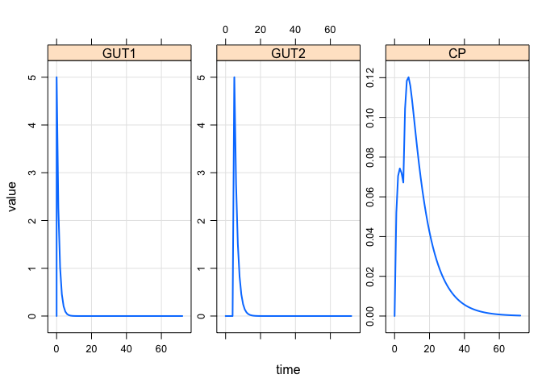

Parallel-firstorder absorption
================

``` r
library(mrgsolve)
library(tidyverse)
```

Two parallel first order absorption models
------------------------------------------

``` r
code <- '
$PARAM CL = 5, VC = 50, KA1 = 0.8, KA2=0.6
GUT1BIOAV = 0.5, GUT1LAGT=0, GUT2BIOAV = 1, GUT2LAGT=5
BIOAV = 1, LAGT = 0

$CMT GUT1 GUT2 CENT

$MAIN
F_GUT1 = GUT1BIOAV;
ALAG_GUT1 = GUT1LAGT;

F_GUT2 = 1- GUT1BIOAV;
ALAG_GUT2 = GUT2LAGT;

F_CENT = BIOAV;
ALAG_CENT = LAGT;

$ODE

dxdt_GUT1 = -KA1*GUT1;
dxdt_GUT2 = -KA2*GUT2;
dxdt_CENT = KA1*GUT1 + KA2*GUT2 - (CL/VC)*CENT;

$TABLE
double CP = CENT/VC;

$CAPTURE CP
'

mod <- mcode_cache("parabs", code)
```

``` r
mod <- update(mod, end=72)
```

### two-parallel first-order events

``` r
ev1 <- ev(ID=1, amt = 10, cmt=1) + ev(ID=1, amt = 10, cmt=2)
out <- mod %>% Req(GUT1, GUT2, CP) %>% mrgsim(ev1)
plot(out)
```


