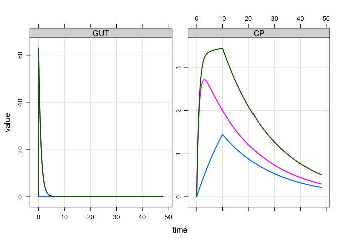

Parallel zero-/first-order absorption
================

``` r
library(dplyr)
library(mrgsolve)
```

## PK model

  - One-compartment, with absorption / depot compartment (`GUT`)
  - We want to administer a single dose, administering a certain
    fraction by a zero-order infusion and the remaining fraction by
    first order absorption
  - To split to dose, we use the bioavailability paramete for `GUT` and
    `CENT`

<!-- end list -->

``` r
code <- '
$PARAM CL = 1, V = 20, KA = 1.1
frac_infusion = 0.37, dur_infusion = 8

$PKMODEL cmt = "GUT CENT", depot = TRUE

$MAIN

D_CENT = dur_infusion;
F_CENT = frac_infusion;
F_GUT =  1-frac_infusion;

$TABLE
capture CP = CENT/V;
'
```

``` r
mod <- mcode("parallel", code) %>% update(end = 48, delta = 0.1)
```

## Parallel zero-/first-order

  - We have 100 mg total dose
  - We will need an event object (or data set) with two dosing records,
    giving the full dose on each record every time we want to administer
    a dose

<!-- end list -->

``` r
infusion <- ev(amt = 100, cmt = "CENT", rate = -2)

zero <- mutate(infusion, cmt = "GUT", rate= 0)

dose <- c(infusion, zero)

dose
```

    . Events:
    .   time amt rate  cmt evid
    . 1    0 100   -2 CENT    1
    . 2    0 100    0  GUT    1

# Result

``` r
out <- mrgsim_e(mod, dose)
```

``` r
plot(out, GUT + CP ~time)
```

<!-- -->

## Show individual components

Let’s set up a simulation where we have 3 subjects: one gets the
infusion (only; blue line), one gets the depot dose (only; pink line)
and the other gets both (green line):

``` r
data <- as_data_set(infusion, zero, dose)
```

``` r
mrgsim_d(mod,data) %>% plot(GUT+CP~time)
```

<!-- -->
