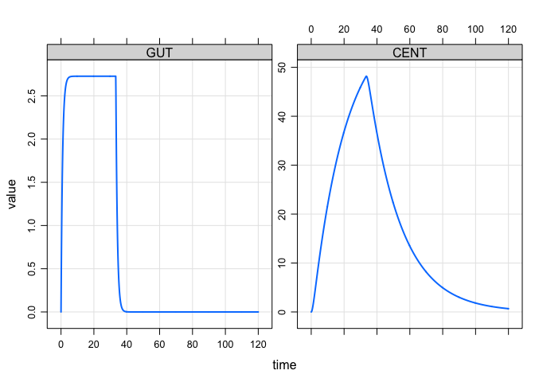

Sequential zero-/first-order absorption
================

``` r
library(mrgsolve)
```

## PK model

  - One-compartment, with absorption / depot compartment (`GUT`)

<!-- end list -->

``` r
code <- '
$PARAM CL = 1, V = 20, KA = 1.1

$PKMODEL cmt = "GUT CENT", depot = TRUE
'
```

``` r
mod <- mcode("sequential", code) %>% update(end = 120, delta = 0.1)
```

## Sequential zero-/first-order

  - We make a zero-order infusion into the `GUT` compartment of 100
    units over 33 hours
  - The `KA` parameter controls the first-order absorption process

<!-- end list -->

``` r
mod %>% ev(amt = 100, rate = 3) %>% 
  mrgsim %>% plot
```

<!-- -->
