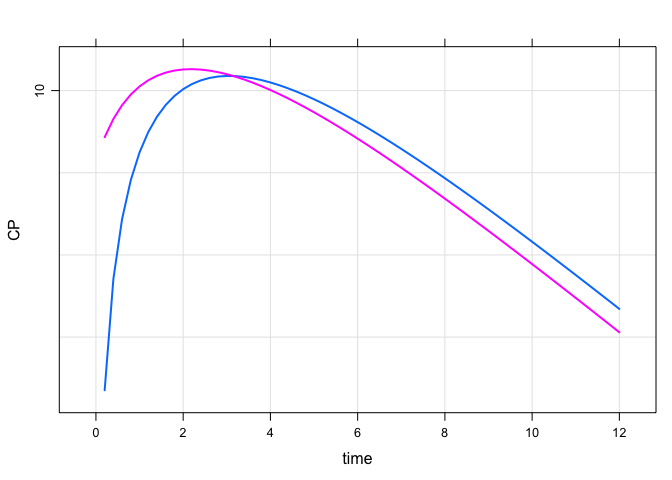

Time-varying KA
================

This gallery piece shows now to implement a time-varying, first-order
absorption rate constant.

``` r
library(dplyr)
library(mrgsolve)
```

Absorption will be first order, and start out very fast (large KA) and
then slow down after a while (smaller KA).

The main things we need to do:

1.  Reset everything when it’s a new individual
2.  When there is a dose, switch to the fast KA and set the time when KA
    will revert back to slow
3.  At the change time, revert to slow

<!-- end list -->

``` r
code <- '
[ param ] KAfast = 3, KAslow = 0.5, CL = 1, V = 5

[ pkmodel ] cmt = "GUT CENT", depot = TRUE

[ main ]

if(NEWIND <=1) {
  double KA = KAslow;
  double mt = -1;
}

if(EVID==1) { 
  KA = KAfast;
  mt = self.mtime(TIME + 0.2);
}

if(TIME > mt) { 
  KA = KAslow;
}

[ table ] capture CP = CENT/V;
'
```

Set up a simulation from this model where we look at all slow absorption
(blue line) or fast then slow (pink line)

``` r
mod <- mcode("foo", code) %>% update(outvars = "CP")

idata <- tibble(KAfast = c(mod$KAslow,2.5))
```

``` r
out <- mrgsim_ei(mod, ev(amt = 100), idata = idata, end = 12, delta = 0.2)

plot(out,logy=TRUE)
```

<!-- -->
