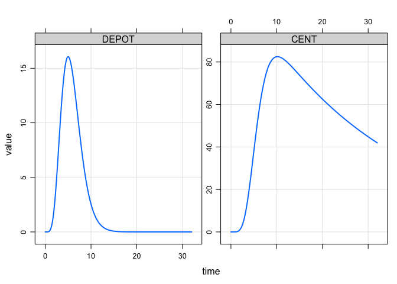
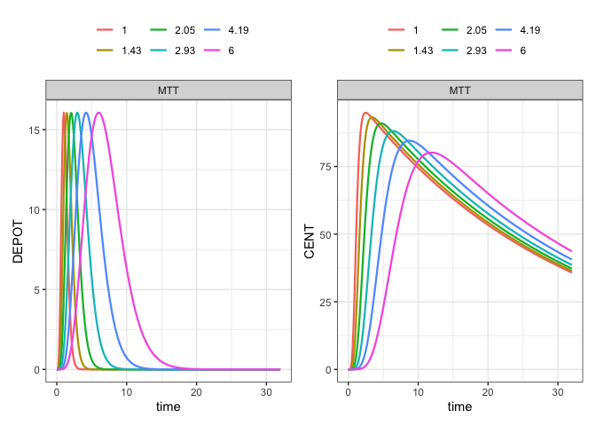

transit model
================

See [transit.ctl](transit.ctl) for NONMEM code.

# Reference

``` txt
; Modified from appendix 4 of Jun Shen, Alison Boeckmann & Andrew Vick
; Modified for NONMEM 7.3
; Journal of Pharmacokinetics and Pharmacodynamics
; ISSN 1567-567X Volume 39 Number 3
; J Pharmacokinet Pharmacodyn (2012) 39:251-262 DOI 10.1007/s10928-012-9247-3
```

# Model code

``` r
library(mrgsolve)

code <- '
[ param ]
CL = 1,  KA = 1.2, V = 30
MTT = 5, NN = 5,   BIO = 1

[ cmt ] DEPOT CENT

[ global ] 

int NDOSE = 0;
double dosetime[300];
double dose[300];

[ main ] 

if(NEWIND < 2) NDOSE = 0; 

if(self.amt > 0 && self.cmt==1) {
 NDOSE = NDOSE + 1; 
 dosetime[NDOSE] = self.time;
 dose[NDOSE] = self.amt;
}

F_DEPOT = 0; 
double KTR  = (NN+1) / MTT; 
double NFAC = sqrt(2.0*3.1416)*pow(NN,NN+0.5)*(exp(-NN))*(1.0+1.0/(12.0*NN)); 
double KINPT = BIO * pow(KTR,(NN+1)) / NFAC; 

[ ode ] 

double INPT = 0;
int i = 0;
while(i <= NDOSE) {
  double IPT = 0;
  if(SOLVERTIME >= dosetime[i]) {
    double delta = SOLVERTIME - dosetime[i];
    IPT = dose[i] * pow(delta, NN) * exp(-KTR * delta);  
  }
  INPT = INPT + IPT;
  ++i;
}

dxdt_DEPOT = KINPT * INPT - KTR * DEPOT;
dxdt_CENT = KTR * DEPOT - (CL/V) * CENT;

'
```

# Examples

``` r
mod <- mcode("transit", code, delta = 0.1, end = 32)
mrgsim(mod, ev(amt = 100)) %>% plot()
```

<!-- -->

## Sensitivity analysis on MTT

``` r
idata <- tibble(MTT = seq(0.5, 10.5, 2))

mrgsim(mod, events = ev(amt = 100), idata = idata) %>% plot()
```

<!-- -->

## Sensitivity analysis on NN

``` r
idata <- tibble(NN = seq(1,21,2))

mrgsim(mod, events = ev(amt = 100), idata = idata) %>% plot()
```

<!-- -->
