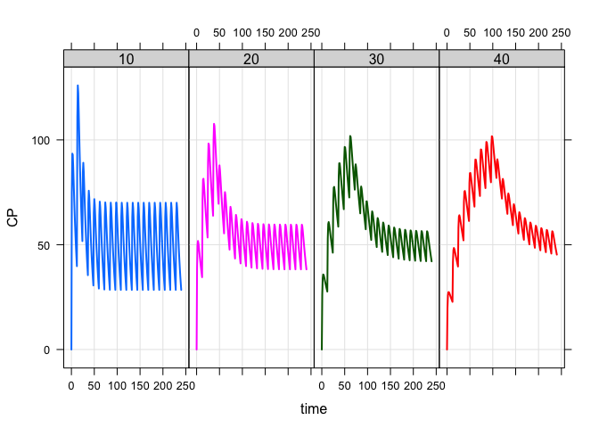
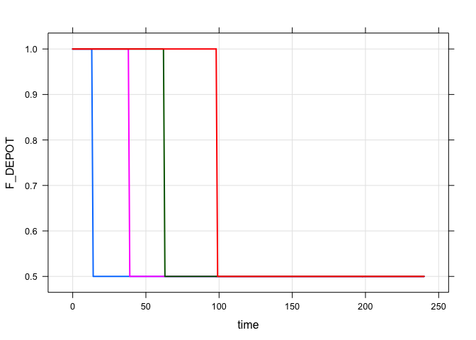

Simple adaptive dosing
================

# Introduction

This is a very simple dose adjustment example, presented as a first
example to get started.

The scenario is:

1.  Dosing regimen of 1200 mg BID over 10 days
2.  Sensitivity analysis for volume of distribution (10 to 40 L)
3.  If the concentration ever reaches some critical concentration (say
    100 mg/L), we cut the dose by some factor (say in half)
4.  Once the dose is adjusted it remains adjusted
5.  Evaluate time when dose adjustment takes place

# The model

``` r
library(mrgsolve)
library(dplyr)

mod <- mread("adaptive_simple", end = 240)
```

``` c
[ prob ]
Simple code to adjust doses.

[ param ]
CL = 1, V = 20, KA = 1.1, F1 = 1, F1adjust = 0.5, condition = 100

[ pkmodel ] cmt = "DEPOT CENT", depot = TRUE

[ preamble ] 
bool condition_met = false;

[ main ]
if(NEWIND <=1) condition_met = false;

F_DEPOT = F1;

if(condition_met) F_DEPOT = F1 * F1adjust;

[ table ] 
capture CP = CENT/V;

condition_met = CP > condition || condition_met;

[ capture ] F_DEPOT condition_met
```

## To note

1.  We set `condition_met` to `false` in preamble and then renew that in
    `[ main ]` when a new individual is encountered.
2.  The bioavailability fraction is adjusted by some amount if the
    critical condition is met.
3.  We always make the adjustment in `[ table ]`, that is, after the
    system has advanced so that doses are adjusted starting the **next**
    time the system advances

# Simulate

``` r
data <- expand.ev(amt = 1200, ii = 12, addl = 19, V = c(10, 20, 30, 40))

out <- mrgsim(mod, data, carry_out = "V")

plot(out, CP ~ time | factor(V), scales="same", layout=c(4,1))
```

<!-- -->

``` r
plot(out, F_DEPOT ~ time, scales = "same")
```

<!-- -->

# Important

This very simple model cuts the dose in half when a critical
concentration is seen. Whether or not the critical concentration is seen
depends on the sampling scheme (when observations are made). For most
applications, I have found it necessary to explicitly state **when** the
critical dose adjustment observation is made (e.g. at the trough or at
week 14 or whatever). This most likely requires some special handling in
the data set, usually including records in the data set with a “custom”
`evid` (like 33) that is your signal for checking the state of the model
and adjusting the dose. mrgsolve won’t do anything with `evid` 33, but
you can

For example:

``` c
[ table ]
condition_met = ((EVID==33) && (CP > condition)) || condition_met;
```
