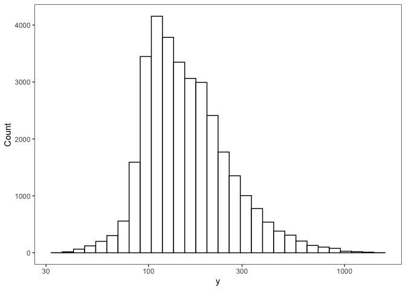

Sobol sensitivity analysis using sensobol
================
Kyle Baron
2021-11-22 16:04:20

-   [Tools](#tools)
-   [The sunitinib PK model](#the-sunitinib-pk-model)
    -   [Sunitinib dosing](#sunitinib-dosing)
-   [Generate samples](#generate-samples)
-   [Run the analysis](#run-the-analysis)
    -   [Simulation](#simulation)
    -   [Calculate AUC](#calculate-auc)
    -   [Indices](#indices)
    -   [Visualize](#visualize)

# Tools

``` r
library(mrgsolve)
library(tidyverse)
library(PKPDmisc)
library(data.table)
library(sensobol)
```

# The sunitinib PK model

``` r
mod <- mread("sunit", "model") %>% 
  update(end = 24, delta = 1) %>% zero_re
```

``` r
see(mod)
```

    . 
    . Model file:  sunit.cpp 
    . $PARAM
    . TVCL = 51.8
    . TVVC = 2030
    . TVKA = 0.195
    . TVQ = 7.22
    . TVVP = 583
    . WTVC = 0.459
    . SEXCL = -0.0876
    . ASIANCL = -0.130
    . GISTCL = -0.285
    . SOLIDCL = -0.269
    . MRCCCL = -0.258
    . SEX = 0, ASIAN = 0, GIST = 0
    . SOLID = 0, MRCC = 0, WT = 76.9
    . 
    . $MAIN
    . double CL  = TVCL * (1+SEXCL*SEX) * (1+ASIANCL*ASIAN) * 
    .   (1+GISTCL*GIST) * (1+SOLIDCL*SOLID) * (1+MRCCCL*MRCC) * exp(ETA(1));
    . 
    . double V2 = TVVC*pow(WT/76.9, WTVC)*exp(ETA(2));
    . double KA = TVKA*exp(ETA(3));
    . double Q  = TVQ;
    . double V3 = TVVP;
    . 
    . $OMEGA 0.14 0.18 0.64
    . 
    . $SIGMA 0.146
    . 
    . $PKMODEL cmt = "GUT CENT, PERIPH", depot = TRUE
    . 
    . $POST
    . capture CP = (1000*CENT/V2);

## Sunitinib dosing

We are just looking at a single dose for now.

``` r
sunev <- function(amt = 50,...) ev(amt = amt, ...)
```

# Generate samples

**Number**

``` r
N <- 2 ^ 15
```

**Generate**

``` r
mat <- sobol_matrices(N = N, params = c("TVCL", "TVVC", "TVKA", "TVQ", "TVVP"))
mat <- as_tibble(mat)
head(mat)
```

    . # A tibble: 6 × 5
    .    TVCL  TVVC  TVKA   TVQ  TVVP
    .   <dbl> <dbl> <dbl> <dbl> <dbl>
    . 1 0.5   0.5   0.5   0.5   0.5  
    . 2 0.75  0.25  0.75  0.25  0.75 
    . 3 0.25  0.75  0.25  0.75  0.25 
    . 4 0.375 0.375 0.625 0.125 0.875
    . 5 0.875 0.875 0.125 0.625 0.375
    . 6 0.625 0.125 0.375 0.375 0.125

**Transform and groom**

For this example, we will just take uniform samples based on the
logarithm of the current value of the parameter.

``` r
params <- unlist(as.list(param(mod))[c("TVCL", "TVVC", "TVKA", "TVQ", "TVVP")])
umin <- log(params / 5)
umax <- log(params * 5)
umin
```

    .      TVCL      TVVC      TVKA       TVQ      TVVP 
    .  2.337952  6.006353 -3.244194  0.367417  4.758749

After setting the minimum and maximum for each parameter, get the value
of the parameter by looking at the quantiles of the (log uniform)
distribution

``` r
mat2 <- imodify(mat, ~ qunif(.x, umin[[.y]], umax[[.y]]))
mat2 <- mutate(mat2, across(everything(), exp), ID = row_number())
head(mat)
```

    . # A tibble: 6 × 5
    .    TVCL  TVVC  TVKA   TVQ  TVVP
    .   <dbl> <dbl> <dbl> <dbl> <dbl>
    . 1 0.5   0.5   0.5   0.5   0.5  
    . 2 0.75  0.25  0.75  0.25  0.75 
    . 3 0.25  0.75  0.25  0.75  0.25 
    . 4 0.375 0.375 0.625 0.125 0.875
    . 5 0.875 0.875 0.125 0.625 0.375
    . 6 0.625 0.125 0.375 0.375 0.125

# Run the analysis

## Simulation

``` r
out <- mrgsim_ei(mod, sunev(), mat2, output = "df")
out <- as.data.table(out)
```

## Calculate AUC

``` r
y <- out[, list(auc = auc_partial(time,CP)), by = "ID"][["auc"]]
```

## Indices

``` r
ind <- sobol_indices(Y = y, N = N, params = names(params), boot = TRUE, R = 1000, first = "jansen")
ind.dummy <- sobol_dummy(Y = y, N = N, params = names(params), boot = TRUE, R = 1000)
```

``` r
ind
```

    . 
    . First-order estimator: jansen | Total-order estimator: jansen 
    . 
    . Total number of model runs: 229376 
    . 
    . Sum of first order indices: 0.772696 
    .         original          bias    std.error       low.ci     high.ci
    .  1: 0.1800927710 -3.760867e-05 0.0083827287  0.163700533 0.196560226
    .  2: 0.5169806384  5.584292e-05 0.0063099667  0.504557488 0.529292103
    .  3: 0.0722516683 -4.918588e-05 0.0071581797  0.058271080 0.086330629
    .  4: 0.0029247659 -1.986201e-04 0.0060640325 -0.008761899 0.015008671
    .  5: 0.0004461823 -1.952871e-04 0.0058164982 -0.010758658 0.012041596
    .  6: 0.3828283356 -9.581848e-05 0.0057481914  0.371657906 0.394190402
    .  7: 0.7289651275  4.369649e-04 0.0083652767  0.712132521 0.744923804
    .  8: 0.1162534021  3.975808e-05 0.0018896917  0.112509916 0.119917372
    .  9: 0.0119834278 -2.048331e-05 0.0003762510  0.011266473 0.012741350
    . 10: 0.0019679814  6.215041e-06 0.0001117312  0.001742777 0.002180756
    .     sensitivity parameters
    .  1:          Si       TVCL
    .  2:          Si       TVVC
    .  3:          Si       TVKA
    .  4:          Si        TVQ
    .  5:          Si       TVVP
    .  6:          Ti       TVCL
    .  7:          Ti       TVVC
    .  8:          Ti       TVKA
    .  9:          Ti        TVQ
    . 10:          Ti       TVVP

## Visualize

``` r
plot(ind, dummy = ind.dummy) + ylim(0,1)
```

<!-- -->
