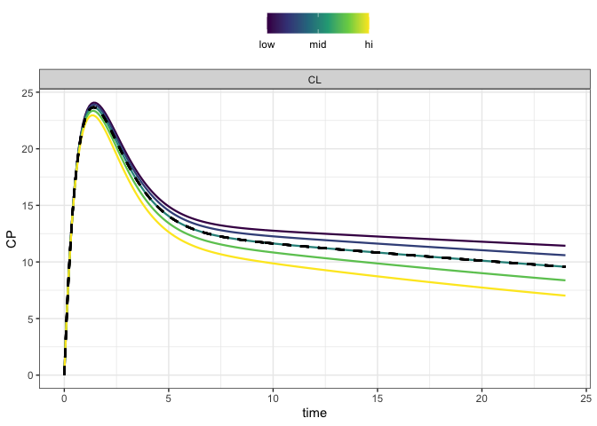
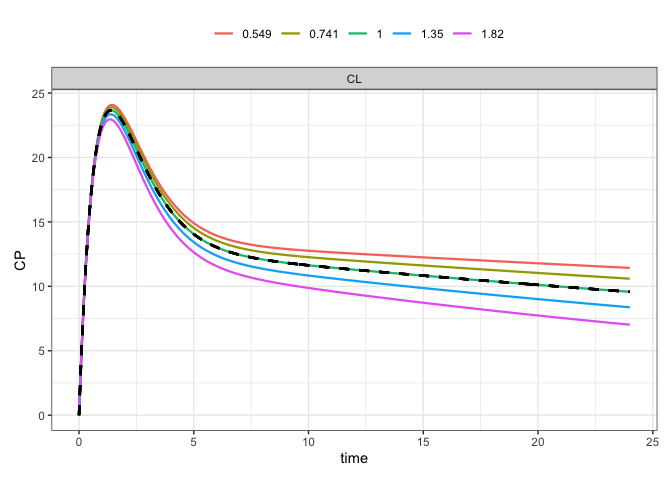
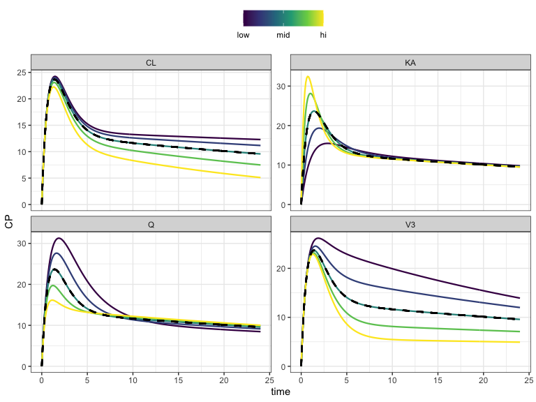
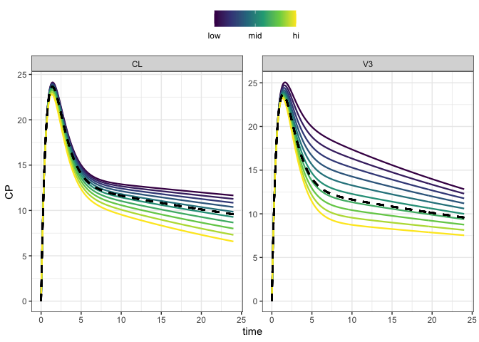
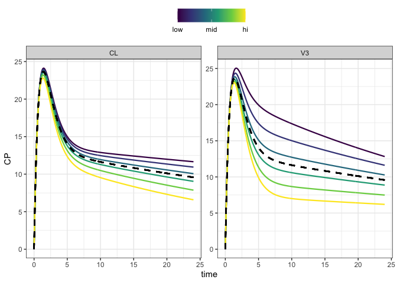
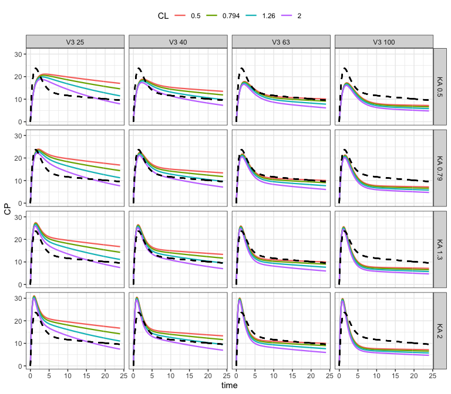
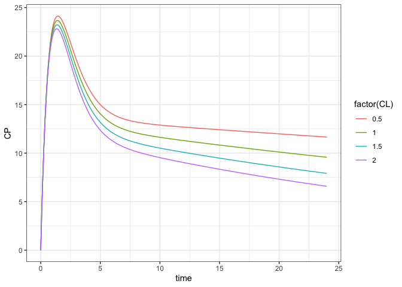

Graphical sensitivity analysis
================
Kyle Baron
2021-12-15 21:57:53

-   [Introduction](#introduction)
-   [Tools](#tools)
-   [Model](#model)
-   [Intervention](#intervention)
-   [Graphical sensitivity analysis](#graphical-sensitivity-analysis)
-   [Code your own](#code-your-own)

# Introduction

What I mean by “graphical” is generating simulated outputs with
parameters varied across a grid of values and making a graphical display
of the results. This is an informal method for visualizing variability
in outputs in relation to variability in inputs. It is similar to [local
sensitivity analysis](local-sa.md) in that parameters are varied one at
a time, but parameters may be varied across the different segments of
the parameter space.

This is in contrast to [global sensitivity
analysis](global-sensobol.md), when all parameters are varied
simultaneously across the entire parameter space.

This vignette uses the mrgsolve in coordination with the
[mrgsim.sa](https://cran.r-project.org/package=mrgsim.sa) package
package in do local sensitivity analysis.

# Tools

``` r
library(mrgsolve)
library(tidyverse)
library(mrgsim.sa)
```

# Model

We’ll perform graphical sensitivity analysis on a 2-compartment PK
model.

``` r
mod <- modlib("pk2") %>%
  update(end = 24, delta = 0.1, outvars = "CP,PERIPH") %>% 
  param(Q = 12, V3 = 50)
```

The parameters of the model are

-   CL
-   V2
-   Q
-   V3
-   KA

``` r
see(mod)
```

    . 
    . Model file:  pk2.cpp 
    . $PARAM @annotated
    . CL   :  1 : Clearance (volume/time)
    . V2   : 20 : Central volume (volume)
    . Q    :  2 : Inter-compartmental clearance (volume/time)
    . V3   : 10 : Peripheral volume of distribution (volume)
    . KA   :  1 : Absorption rate constant (1/time)
    . 
    . $CMT @annotated
    . EV     : Extravascular compartment (mass)
    . CENT   : Central compartment (mass)
    . PERIPH : Peripheral compartment (mass) 
    . 
    . $GLOBAL
    . #define CP (CENT/V2)
    . 
    . $PKMODEL ncmt = 2, depot = TRUE
    . 
    . $CAPTURE @annotated
    . CP : Plasma concentration (mass/time)
    . 

# Intervention

We are just looking at a single dose for now.

``` r
dose <- function(amt = 1000,...) ev(amt = amt, ...)
```

# Graphical sensitivity analysis

First, let’s look at how to do this with the `mrgsim.sa` package. As a
test run let’s vary CL with 30% coefficient of variation around the
nominal value in the model object

``` r
ans <- 
  mod %>% 
  ev(dose()) %>% 
  parseq_cv(CL, .cv = 30) %>%
  sens_each() 
```

The output is simulated data in long format

``` r
head(ans)
```

    . # A tibble: 6 × 7
    .    case  time p_name p_value dv_name dv_value ref_value
    . * <int> <dbl> <chr>    <dbl> <chr>      <dbl>     <dbl>
    . 1     1     0 CL       0.549 PERIPH         0         0
    . 2     1     0 CL       0.549 PERIPH         0         0
    . 3     1     0 CL       0.549 CP             0         0
    . 4     1     0 CL       0.549 CP             0         0
    . 5     1     0 CL       0.549 PERIPH         0         0
    . 6     1     0 CL       0.549 PERIPH         0         0

And we can make a plot of this data

``` r
ans %>% sens_plot("CP")
```

<!-- -->

In the plot - Parameters are varied across 2 standard deviations of a
distribution with 30% CV (see `?parseq_cv`) - We have some parameters
with “low” value and some with “high” value - There is a dashed
reference line that shows the simulated simulated data with no change in
the model parameters from what is currently in the model object

To see the values in the legend

``` r
sens_plot(ans, "CP", grid = TRUE)
```

<!-- -->

We can look at multiple parameters, this time with larger CV

``` r
mod %>% 
  ev(dose()) %>% 
  parseq_cv(CL, V3, KA, Q, .cv = 50) %>%
  sens_each() %>%
  sens_plot("CP")
```

<!-- -->

Rather than looking across a certain CV, we can just specify the range

``` r
mod$CL
```

    . [1] 1

``` r
mod$V3
```

    . [1] 50

``` r
mod %>% 
  ev(dose()) %>% 
  parseq_range(CL = c(0.5,2), V3 = c(25,75), .n = 10) %>%
  sens_each() %>%
  sens_plot("CP")
```

<!-- -->

Or vary a parameter by a “factor” (double / half)

``` r
mod %>% 
  ev(dose()) %>% 
  parseq_fct(CL, V3, .n = 6) %>%
  sens_each() %>%
  sens_plot("CP")
```

<!-- -->

The user can also simulate across a complete grid of values

``` r
mod %>% 
  ev(dose()) %>% 
  parseq_fct(CL, V3, KA, .n = 4) %>%
  sens_grid() %>%
  sens_plot("CP")
```

<!-- -->

# Code your own

The `mrgsim.sa` package makes it convenient to simulate and plot these
results. However, you can also code your own simulations to look at
similar types of questions. I’ll use the chunks below to illustrate the
workflow. You’ll see that the output isn’t as refined as what you get
from `mrgsim.sa`, but it can be polished with additional coding.

To do this sort of sensitivity analysis, we use `idata_set`

``` r
idata <- tibble(CL = seq_even(0.5, 2, 4))
idata
```

    . # A tibble: 4 × 1
    .      CL
    .   <dbl>
    . 1   0.5
    . 2   1  
    . 3   1.5
    . 4   2

``` r
out <- mrgsim_ei(mod, dose(), idata, carry_out = "CL", output = "df")
head(out)
```

    .   ID time  CL    PERIPH        CP
    . 1  1  0.0 0.5  0.000000  0.000000
    . 2  1  0.0 0.5  0.000000  0.000000
    . 3  1  0.1 0.5  2.819859  4.611214
    . 4  1  0.2 0.5 10.607294  8.510634
    . 5  1  0.3 0.5 22.455244 11.788369
    . 6  1  0.4 0.5 37.578679 14.524110

``` r
ggplot(out) + geom_line(aes(time, CP, color = factor(CL))) + theme_bw()
```

<!-- -->

The code that `mrgsim.sa` uses is just a more robust or sophisticated
implementation of the code here.
