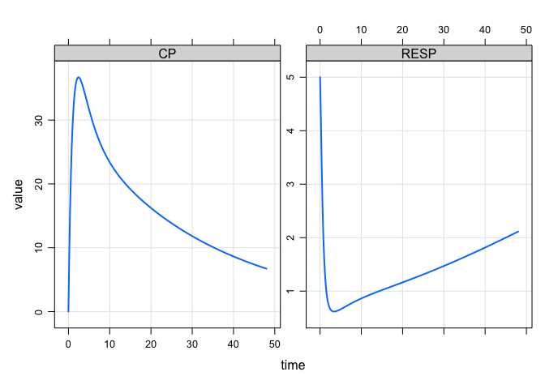

Local sensitivity analysis using mrgsim.sa
================
Kyle Baron
2021-12-04 11:33:00

-   [Introduction](#introduction)
-   [Tools](#tools)
-   [Model](#model)
-   [Intervention](#intervention)
-   [Local sensitivity analysis](#local-sensitivity-analysis)
    -   [Visualize](#visualize)
    -   [Multiple outputs](#multiple-outputs)

# Introduction

Local sensitivity analysis consists of comparing variation in model
parameters against variation in model out puts when the parameters are
varied one at a time and by only very small amounts. This is in contrast
to [global sensitivity analysis](global-sensobol.md), when all
parameters are varied simultaneously across the entire parameter space.

This vignette uses the mrgsolve in coordination with the
[mrgsim.sa](https://cran.r-project.org/package=mrgsim.sa) package
package in do local sensitivity analysis.

# Tools

``` r
library(mrgsolve)
library(tidyverse)
library(mrgsim.sa)
```

# Model

We’ll perform local sensitivity analysis on a 2-compartment PK model.

``` r
mod <- modlib("pk2") %>%
  update(end = 72, delta = 0.1, outvars = "CP") %>% 
  param(Q = 12, V3 = 50)
```

The parameters of the model are

-   CL
-   V2
-   Q
-   V3
-   KA

``` r
see(mod)
```

    . 
    . Model file:  pk2.cpp 
    . $PARAM @annotated
    . CL   :  1 : Clearance (volume/time)
    . V2   : 20 : Central volume (volume)
    . Q    :  2 : Inter-compartmental clearance (volume/time)
    . V3   : 10 : Peripheral volume of distribution (volume)
    . KA   :  1 : Absorption rate constant (1/time)
    . 
    . $CMT @annotated
    . EV     : Extravascular compartment (mass)
    . CENT   : Central compartment (mass)
    . PERIPH : Peripheral compartment (mass) 
    . 
    . $GLOBAL
    . #define CP (CENT/V2)
    . 
    . $PKMODEL ncmt = 2, depot = TRUE
    . 
    . $CAPTURE @annotated
    . CP : Plasma concentration (mass/time)
    . 

# Intervention

We are just looking at a single dose for now.

``` r
dose <- function(amt = 1000,...) ev(amt = amt, ...)
```

# Local sensitivity analysis

The function we’ll use is `mrgsim.sa::lsa`. The call to `lsa` looks like

``` r
res <- lsa(mod, par = "CL,V2,Q,V3,KA", var = "CP", events = dose())
```

We have specified

-   `par`: the names of the parameters we want to include in the
    sensitivity analysis
-   `var`: the name of the output variable; the `mrgsolve` model must
    generate this output
-   `events`: this is passed under the `...` argument to `lsa()`; these
    arguments eventually get passed to the simulation function (see
    below)

We have not specified `fun`, which is a non-exported wrapper function
for `mrgsolve::mrgsim()`

``` r
mrgsim.sa:::.lsa_fun
```

    . function (mod, ...) 
    . {
    .     mrgsim(mod, ...)
    . }
    . <bytecode: 0x7fb6d17f9b58>
    . <environment: namespace:mrgsim.sa>

You can create your own `fun`ction and then pass objects to that
function to carry out the simulation. Note that `lsa()` will always pass
`mod` to your simulation function as the first argument.

## Visualize

The local sensitivity analysis usually completes very quickly. The
output is a regular data frame with the simulated sensitivity data in
long format

``` r
head(res)
```

    . # A tibble: 6 × 5
    .    time dv_name dv_value p_name     sens
    .   <dbl> <chr>      <dbl> <chr>     <dbl>
    . 1   0   CP          0    CL      0      
    . 2   0   CP          0    CL      0      
    . 3   0.1 CP          4.61 CL     -0.00251
    . 4   0.2 CP          8.49 CL     -0.00506
    . 5   0.3 CP         11.7  CL     -0.00763
    . 6   0.4 CP         14.4  CL     -0.0102

`mrgsim.sa` provides a plot method for visualizing the result

``` r
res %>% filter(time <= 72) %>% plot()
```

<!-- -->

Or you can easily make your own plot

``` r
ggplot(res, aes(time, sens, color = p_name)) + 
  facet_wrap(~p_name) + 
  geom_line(lwd=1) + 
  theme_bw() + theme(legend.position = "top")
```

<!-- -->

## Multiple outputs

For example, we can look at multiple outputs from an indirect response
model

``` r
mod <- modlib("irm1", delta = 0.1, end = 14, rtol = 1e-10) 
```

``` r
param(mod)
```

    . 
    .  Model parameters (N=13):
    .  name value . name value
    .  CL   1     | KOUT 2    
    .  IC50 2     | n    1    
    .  IMAX 1     | Q    2    
    .  KA   1     | V2   20   
    .  KA2  1     | V3   10   
    .  KIN  10    | VMAX 0    
    .  KM   2     | .    .

``` r
mrgsim(mod, dose()) %>% plot("CP,RESP")
```

<!-- -->

Run the analysis

``` r
res <- lsa(mod, par = "CL,V2,Q,KA,IC50", var = "CP,RESP", events = dose())
```

Plot the result

``` r
plot(res)
```

<!-- -->
