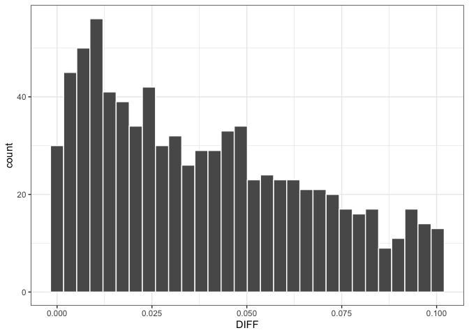
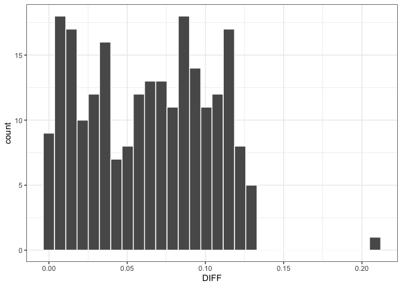

Simulating large time-to-event trials with mrgsolve
================

# Introduction

This vignette shows implementation of MTIME approach to simulating large
time-to-event trial in NONMEM. We show both the Repeated Time-to-Event
model.

## Reference

**Simulating large time-to-event trials in NONMEM**

Joakim Nyberg, Kristin E. Karlsson, Siv Jönsson, Ulrika S.H. Simonsson,
Mats O. Karlsson and Andrew C. Hooker

PAGE 23 (2014) Abstr 3166 <https://www.page-meeting.org/?abstract=3166>

``` r
library(tidyverse)
theme_set(theme_bw())
library(mrgsolve)
```

# TTE Model

``` r
data <- data.frame(
  TIME = c(0, 100), 
  CMT = 0, 
  AMT = 0, 
  EVID = 0
)
ids <- seq(1, 1000)
data <- crossing(ID = ids, data)

head(data)
```

    . # A tibble: 6 × 5
    .      ID  TIME   CMT   AMT  EVID
    .   <int> <dbl> <dbl> <dbl> <dbl>
    . 1     1     0     0     0     0
    . 2     1   100     0     0     0
    . 3     2     0     0     0     0
    . 4     2   100     0     0     0
    . 5     3     0     0     0     0
    . 6     3   100     0     0     0

## Read mtime-tte.txt model file

``` r
mod <- mread("mtime-tte.txt", end = -1)
```

    . Building mtime-tte_txt ... done.

``` r
set.seed(98765)
out <- mrgsim(mod, data)

head(out)
```

    .   ID TIME       A1
    . 1  1    0 0.000000
    . 2  1  100 1.553957
    . 3  2    0 0.000000
    . 4  2  100 1.553957
    . 5  3    0 0.000000
    . 6  3  100 1.553957

## Check event output

``` r
res <- as.list(mod@envir)
x <- matrix(res$data, ncol = length(res$names), byrow=TRUE)
x <- as.data.frame(x)
names(x) <- res$names

head(x)
```

    .   ID DV      EVT RTTE      SURX ICOUNT      RAND
    . 1  1  1 24.19802    1 0.6068857      1 0.6078409
    . 2  2  1 34.53460    1 0.5148876      2 0.5149525
    . 3  3  1 47.27577    1 0.4259670      3 0.4264116
    . 4  4  1 33.53130    1 0.5229165      4 0.5230318
    . 5  5  1 36.54116    1 0.4993306      5 0.4997081
    . 6  6  1 14.76696    1 0.7143299      6 0.7144554

### Calculate analytic Event Time

``` r
x <- mutate(
  x, 
  AT = (-log(RAND))^(1/mod$THETA2)/mod$THETA1, 
  DIFF = EVT - AT
)

head(x)
```

    ##   ID DV      EVT RTTE      SURX ICOUNT      RAND       AT        DIFF
    ## 1  1  1 24.19802    1 0.6068857      1 0.6078409 24.10266 0.095352199
    ## 2  2  1 34.53460    1 0.5148876      2 0.5149525 34.52625 0.008348309
    ## 3  3  1 47.27577    1 0.4259670      3 0.4264116 47.20338 0.072386688
    ## 4  4  1 33.53130    1 0.5229165      4 0.5230318 33.51691 0.014395118
    ## 5  5  1 36.54116    1 0.4993306      5 0.4997081 36.49131 0.049853239
    ## 6  6  1 14.76696    1 0.7143299      6 0.7144554 14.75719 0.009770721

### Difference between MTIME and Analytic Time

Take time to first event

``` r
xx <- distinct(x, ID, .keep_all = TRUE)

xx <- filter(xx, DV==1)

ggplot(xx, aes(x = DIFF)) + 
  geom_histogram(color = "white")
```

    ## `stat_bin()` using `bins = 30`. Pick better value with `binwidth`.

<!-- -->

## Model code

``` r
[ theta ] 0.01735 0.8 0.1

[ omega ] 0

[ set ] rtol = 1e-9, atol = 1e-9

[ plugin ]  autodec,  Rcpp, mrgx

[ cmt ] A1

[ global ] 
std::vector<double> COM(8);
std::vector<double> out;

[ pk ] 
LAM  = THETA(1) * exp(ETA(1));
SHP = THETA(2);

if(NEWIND==0) {
  COM[6] = 1;
  COM[4] = 100;
}

if(NEWIND==1) {
  ICOUNT = COM[6] + 1;
  COM[6] = ICOUNT;
}

if(NEWIND != 2) {
  RR = R::runif(0,1);
  COM[3] = -1; 
  COM[2] = RR; 
  COM[1] = -1;
  COM[7] = 0; 
}

id = ID;

[ des ] 

DEL = 1e-7;

dxdt_A1 = LAM*SHP*pow(LAM*SOLVERTIME+DEL,SHP-1);

SUR = exp(-A1);

if(COM[2] > SUR && COM[1]==-1) {
  COM[1] = SOLVERTIME;
  COM[3] = SUR; 
}

[ error ] 
CHZ = A1;
SURX = exp(-CHZ);

if(COM[1] > COM[4]) {
  if(COM[2] > SURX) {
    COM[1] = COM[4];
  } else {
    COM[1] = -1;  
  }
}

EVT = COM[1];
RNM = COM[2];

ENDTIME = COM[4];
TT = COM[5];

DV = 0; 
TMDV = 0;

if(EVID > 0) TMDV = 1;

ICOUNT = COM[6];

if(NEWIND ==0) out.clear();

if(TIME <= 100) {
  mt = self.mtime(TIME + THETA(3));
}

if(EVT != -1) {
  DV = 1;
  RTTE = 1; 
  TMDV = 0;
  out.push_back(id); 
  out.push_back(DV); 
  out.push_back(EVT);
  out.push_back(RTTE);
  out.push_back(COM[3]);
  out.push_back(ICOUNT);
  out.push_back(COM[2]);
  COM[1] = -1;
  COM[2] = 0;
  COM[3] = -1; 
  COM[7] = COM[7] + 1;
  } else if (TIME==100 && COM[7]==0) {
    DV = 0; 
    TMDV = 0; 
    RTTE = 1;
    TMP = COM[4];
    out.push_back(id); 
    out.push_back(DV); 
    out.push_back(TMP);
    out.push_back(RTTE);
    out.push_back(SURX);
    out.push_back(ICOUNT);
    out.push_back(COM[2]);
  }


if(self.rown +1 == self.nrow) {
  std::vector<std::string> names; 
  names.push_back("ID");
  names.push_back("DV"); 
  names.push_back("EVT"); 
  names.push_back("RTTE"); 
  names.push_back("SURX");
  names.push_back("ICOUNT");
  names.push_back("RAND");
  mrgx::get_envir(self).assign("data", out);
  mrgx::get_envir(self).assign("names", names);
}
```

# RTTE Model

## Input data

``` r
data <- data.frame(
  TIME = c(0, 288), 
  CMT = 0, 
  AMT = 0, 
  EVID = 0
)
ids <- seq(1, 300)
data <- crossing(ID = ids, data)

head(data)
```

    . # A tibble: 6 × 5
    .      ID  TIME   CMT   AMT  EVID
    .   <int> <dbl> <dbl> <dbl> <dbl>
    . 1     1     0     0     0     0
    . 2     1   288     0     0     0
    . 3     2     0     0     0     0
    . 4     2   288     0     0     0
    . 5     3     0     0     0     0
    . 6     3   288     0     0     0

## Read rtte.txt model file

``` r
mod <- mread("mtime-rtte.txt", end = -1)
```

    . Building mtime-rtte_txt ... done.

``` r
set.seed(98765)
out <- mrgsim(mod, data)

head(out)
```

    .   ID TIME       A1
    . 1  1    0 0.000000
    . 2  1  288 2.155004
    . 3  2    0 0.000000
    . 4  2  288 1.395972
    . 5  3    0 0.000000
    . 6  3  288 1.003641

## Check event output

``` r
res <- as.list(mod@envir)
x <- matrix(res$data, ncol = length(res$names), byrow=TRUE)
x <- as.data.frame(x)
names(x) <- res$names

head(x)
```

    .   ID DV       TIME         R        BASE
    . 1  1  1 111.989477 0.4327388 0.007482653
    . 2  1  1 175.056369 0.6240704 0.007482653
    . 3  2  1 104.784654 0.6018752 0.004847126
    . 4  4  1   9.111563 0.9376066 0.007090281
    . 5  4  1 238.529145 0.1966469 0.007090281
    . 6  4  1 241.393985 0.9804362 0.007090281

## Calculate analytic Event Time

``` r
x <- mutate(
  x, 
  AT = -log(R)/BASE, 
  DIFF = TIME - AT
)

head(x)
```

    ##   ID DV       TIME         R        BASE         AT         DIFF
    ## 1  1  1 111.989477 0.4327388 0.007482653 111.941713   0.04776402
    ## 2  1  1 175.056369 0.6240704 0.007482653  63.011350 112.04501842
    ## 3  2  1 104.784654 0.6018752 0.004847126 104.743544   0.04111040
    ## 4  4  1   9.111563 0.9376066 0.007090281   9.086349   0.02521333
    ## 5  4  1 238.529145 0.1966469 0.007090281 229.376715   9.15242952
    ## 6  4  1 241.393985 0.9804362 0.007090281   2.786591 238.60739373

## Difference between MTIME and Analytic Time

Take time to first event

``` r
xx <- distinct(x, ID, .keep_all = TRUE)
ggplot(xx, aes(x = DIFF)) + 
  geom_histogram(color = "white")
```

    ## `stat_bin()` using `bins = 30`. Pick better value with `binwidth`.

<!-- -->

## Model code

``` r
[ theta ] 0.0058 0.1

[ omega ] 0.09

[ set ] rtol = 1e-9, atol = 1e-9

[ plugin ]  autodec,  Rcpp, mrgx

[ cmt ] A1

[ global ] 
std::vector<double> COM(9);
std::vector<double> out;

[ pk ] 
BASE = THETA(1) * exp(ETA(1));

if(NEWIND==0) {
  COM[6] = 1;
  out.clear();
}

if(NEWIND==1) {
  ICOUNT = COM[6] + 1;
  COM[6] = ICOUNT;
}

if(NEWIND != 2) {
  RR = R::runif(0,1);
  COM[4] = 288; 
  COM[3] = -1; 
  COM[2] = RR; 
  COM[1] = -1;
  COM[7] = 0; 
  COM[8] = 0;
}

id = ID;

[ des ] 
dxdt_A1 = BASE;

SUR = exp(-(A1-COM[8]));
XR = 0;

if(COM[2] > SUR) {
  COM[1] = SOLVERTIME;
  COM[3] = SUR; 
  COM[8] = A1;
  COM[7] = COM[7] + 1;
  RR = R::runif(0,1);
  TMP = COM[2];
  COM[2] = RR;
  MYDV = 1;
  if(SOLVERTIME < COM[4]) {
    out.push_back(id); 
    out.push_back(MYDV); 
    out.push_back(COM[1]);
    out.push_back(TMP);
    out.push_back(BASE);
  }
}

[ error ] 

if(TIME <= 288) {
  mt = self.mtime(TIME + THETA(2));
}

if(self.rown +1 == self.nrow) {
  std::vector<std::string> names; 
  names.push_back("ID");
  names.push_back("DV"); 
  names.push_back("TIME"); 
  names.push_back("R"); 
  names.push_back("BASE");
  mrgx::get_envir(self).assign("data", out);
  mrgx::get_envir(self).assign("names", names);
}
```
