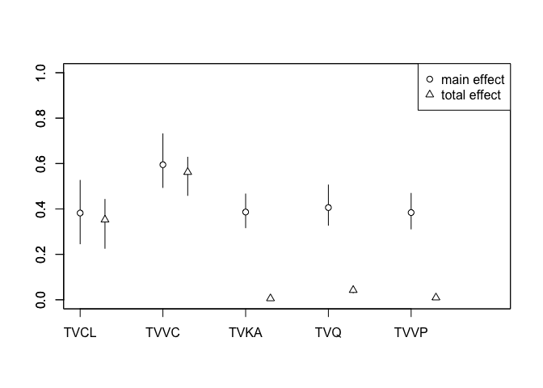

Sobol sensitivity analysis
================
Kyle Baron and Ahmed Elmokadem
2018-02-01 12:58:40

-   [Reference / About](#reference-about)
-   [Tools](#tools)
-   [The sunitinib PK model](#the-sunitinib-pk-model)
    -   [Sunitinib dosing](#sunitinib-dosing)
-   [Generate samples](#generate-samples)
-   [A bunch of helper functions](#a-bunch-of-helper-functions)
-   [Run the analysis](#run-the-analysis)
    -   [First, generate the samples](#first-generate-the-samples)
    -   [Then, run `sensitivity::soboljansen`](#then-run-sensitivitysoboljansen)
-   [Results](#results)
-   [Session](#session)

Reference / About
=================

Zhang XY, Trame MN, Lesko LJ, Schmidt S. **Sobol Sensitivity Analysis: A Tool to Guide the Development and Evaluation of Systems Pharmacology Models**. CPT Pharmacometrics Syst Pharmacol. 2015 Feb;4(2):69-79. doi: 10.1002/psp4.6. PubMed PMID: [27548289](https://www.ncbi.nlm.nih.gov/pubmed/27548289)

This example replicates an analysis presented in the Zhang et al. paper, but here using mrgsolve and other tools available for R.

Tools
=====

``` r
library(mrgsolve)
library(tidyverse)
library(PKPDmisc)
library(sensitivity)
```

The sunitinib PK model
======================

``` r
mod <- mread("sunit", "model") %>% 
  update(end = 24, delta = 1) %>% zero_re
```

``` r
see(mod)
```

    . 
    . Model file:  sunit.cpp 
    .  $PARAM
    .  TVCL = 51.8
    .  TVVC = 2030
    .  TVKA = 0.195
    .  TVQ = 7.22
    .  TVVP = 583
    .  WTVC = 0.459
    .  SEXCL = -0.0876
    .  ASIANCL = -0.130
    .  GISTCL = -0.285
    .  SOLIDCL = -0.269
    .  MRCCCL = -0.258
    .  SEX = 0, ASIAN = 0, GIST = 0
    .  SOLID = 0, MRCC = 0, WT = 76.9
    .  
    .  $MAIN
    .  double CL  = TVCL * (1+SEXCL*SEX) * (1+ASIANCL*ASIAN) * 
    .    (1+GISTCL*GIST) * (1+SOLIDCL*SOLID) * (1+MRCCCL*MRCC) * exp(ETA(1));
    .  
    .  double V2 = TVVC*pow(WT/76.9, WTVC)*exp(ETA(2));
    .  double KA = TVKA*exp(ETA(3));
    .  double Q  = TVQ;
    .  double V3 = TVVP;
    .  
    .  $OMEGA 0.14 0.18 0.64
    .  
    .  $SIGMA 0.146
    .  
    .  $PKMODEL cmt = "GUT CENT, PERIPH", depot = TRUE
    .  
    .  $POST
    .  capture CP = (1000*CENT/V2);
    . 

Sunitinib dosing
----------------

``` r
sunev <- function(amt = 50,...) ev(amt = amt, ...)
```

Generate samples
================

This first function calls `parameterSets` from the sensitivity package. We pass in a list of parameters (with names) and we simulate `2*n` samples for every parameter.

The return value is a list with two data frames that can be passed into the sobol function.

``` r
gen_sobol <- function(n, l, which = names(l), 
                      factor = c(0.01, 100)) {
  
  stopifnot(requireNamespace("sensitivity"))
  
  vars <- select_vars(names(l), !!(enquo(which)))
  
  l <- as.list(l)[vars]
  
  l <- lapply(l, function(x) {
    x*factor  
  })
  
  n <- length(l)*n*2
  
  samp <- parameterSets(par.ranges = l, 
                        samples = n, 
                        method = "sobol")
  
  samp <- set_names(as.data.frame(samp), names(l))
  
  first <- n/2
  
  second <- first+1
  
  list(samp[1:first,],samp[second:n,])
}
```

A bunch of helper functions
===========================

Simulate one chunk of data; not absolutely needed for this; but we might use it if we expand this to run in parallel. I'll keep it around for now.

``` r
sim_chunk <- function(mod, x) {
  mrgsim_ei(x = mod, ev = sunev(), idata = x, obsonly = TRUE) %>% 
    as_data_frame
}
```

Simulate a batch of data. The summary is AUC for each individual.

``` r
batch_run <- function(x) {
  out <- sim_chunk(mod,x)
  out <- 
    group_by(out,ID) %>% 
    summarise(AUC = auc_partial(time,CP))
  return(out$AUC)
}
```

Run the analysis
================

First, generate the samples
---------------------------

``` r
samp <- gen_sobol(5000, param(mod), TVCL:TVVP)

head(samp[[1]])
```

    .       TVCL      TVVC      TVKA       TVQ      TVVP
    . 1 2590.259 101510.15  9.750975 361.03610 29152.915
    . 2 3885.130  50765.23 14.625488 180.55415 43726.458
    . 3 1295.389 152255.08  4.876462 541.51805 14579.372
    . 4 1942.824  76137.69 12.188231  90.31318 51013.229
    . 5 4532.565 177627.54  2.439206 451.27708 21866.144
    . 6 3237.694  25392.76  7.313719 270.79513  7292.601

Then, run `sensitivity::soboljansen`
------------------------------------

``` r
x <- soboljansen(batch_run, X1=samp[[1]], X2=samp[[2]], nboot=100)
```

Results
=======

``` r
plot(x)
```



``` r
x
```

    . 
    . Call:
    . soboljansen(model = batch_run, X1 = samp[[1]], X2 = samp[[2]],     nboot = 100)
    . 
    . Model runs: 175000 
    . 
    . First order indices:
    .       original        bias std. error min. c.i. max. c.i.
    . TVCL 0.3892124 0.005964781 0.07182039 0.2661871 0.5406196
    . TVVC 0.5905834 0.006610447 0.05992586 0.4868937 0.7290147
    . TVKA 0.3863340 0.003832542 0.03323116 0.3210421 0.4519995
    . TVQ  0.4056261 0.003698945 0.04017953 0.3289234 0.5064001
    . TVVP 0.3841869 0.002770308 0.03445079 0.3236074 0.4560127
    . 
    . Total indices:
    .         original          bias   std. error   min. c.i.   max. c.i.
    . TVCL 0.343163099 -1.966976e-03 0.0557680527 0.209495733 0.428180945
    . TVVC 0.564531363 -6.692817e-03 0.0441926119 0.467371744 0.649838831
    . TVKA 0.005682896 -7.392882e-06 0.0006743975 0.003955947 0.006766684
    . TVQ  0.041271538 -2.161320e-04 0.0065683716 0.028649453 0.053980717
    . TVVP 0.009486263 -5.876025e-05 0.0025040052 0.002435703 0.013237916

Session
=======

``` r
devtools::session_info()
```

    .  setting  value                       
    .  version  R version 3.4.2 (2017-09-28)
    .  system   x86_64, darwin15.6.0        
    .  ui       X11                         
    .  language (EN)                        
    .  collate  en_US.UTF-8                 
    .  tz       America/Chicago             
    .  date     2018-02-01                  
    . 
    .  package       * version     date       source                            
    .  assertthat      0.2.0       2017-04-11 CRAN (R 3.4.0)                    
    .  backports       1.1.2       2017-12-13 CRAN (R 3.4.2)                    
    .  base          * 3.4.2       2017-10-04 local                             
    .  bindr           0.1         2016-11-13 CRAN (R 3.4.0)                    
    .  bindrcpp      * 0.2         2017-06-17 cran (@0.2)                       
    .  boot            1.3-20      2017-08-06 CRAN (R 3.4.2)                    
    .  broom           0.4.3       2017-11-20 CRAN (R 3.4.2)                    
    .  cellranger      1.1.0       2016-07-27 CRAN (R 3.4.0)                    
    .  cli             1.0.0       2017-11-05 cran (@1.0.0)                     
    .  colorspace      1.3-2       2016-12-14 CRAN (R 3.4.0)                    
    .  compiler        3.4.2       2017-10-04 local                             
    .  crayon          1.3.4       2017-09-16 CRAN (R 3.4.1)                    
    .  datasets      * 3.4.2       2017-10-04 local                             
    .  devtools        1.13.4      2017-11-09 CRAN (R 3.4.2)                    
    .  digest          0.6.15      2018-01-28 CRAN (R 3.4.2)                    
    .  dplyr         * 0.7.4       2017-09-28 CRAN (R 3.4.2)                    
    .  evaluate        0.10.1      2017-06-24 CRAN (R 3.4.0)                    
    .  forcats       * 0.2.0       2017-01-23 CRAN (R 3.4.0)                    
    .  foreign         0.8-69      2017-06-22 CRAN (R 3.4.1)                    
    .  ggplot2       * 2.2.1.9000  2018-01-29 Github (thomasp85/ggplot2@f53b99f)
    .  glue            1.2.0.9000  2018-01-12 Github (tidyverse/glue@1592ee1)   
    .  graphics      * 3.4.2       2017-10-04 local                             
    .  grDevices     * 3.4.2       2017-10-04 local                             
    .  grid            3.4.2       2017-10-04 local                             
    .  gtable          0.2.0       2016-02-26 CRAN (R 3.4.0)                    
    .  haven           1.1.1       2018-01-18 CRAN (R 3.4.2)                    
    .  hms             0.4.1       2018-01-24 CRAN (R 3.4.2)                    
    .  htmltools       0.3.6       2017-04-28 CRAN (R 3.4.0)                    
    .  httr            1.3.1       2017-08-20 CRAN (R 3.4.1)                    
    .  jsonlite        1.5         2017-06-01 CRAN (R 3.4.0)                    
    .  knitr           1.19        2018-01-29 CRAN (R 3.4.2)                    
    .  lattice         0.20-35     2017-03-25 CRAN (R 3.4.2)                    
    .  lazyeval        0.2.1       2017-10-29 cran (@0.2.1)                     
    .  lubridate       1.7.1       2017-11-03 CRAN (R 3.4.2)                    
    .  magrittr        1.5         2014-11-22 CRAN (R 3.4.0)                    
    .  memoise         1.1.0       2017-04-21 CRAN (R 3.4.0)                    
    .  methods       * 3.4.2       2017-10-04 local                             
    .  mnormt          1.5-5       2016-10-15 CRAN (R 3.4.0)                    
    .  modelr          0.1.1       2017-07-24 CRAN (R 3.4.1)                    
    .  mrgsolve      * 0.8.10.9005 2018-01-22 local                             
    .  munsell         0.4.3       2016-02-13 CRAN (R 3.4.0)                    
    .  nlme            3.1-131     2017-02-06 CRAN (R 3.4.2)                    
    .  parallel        3.4.2       2017-10-04 local                             
    .  pillar          1.1.0       2018-01-14 cran (@1.1.0)                     
    .  pkgconfig       2.0.1       2017-03-21 CRAN (R 3.4.0)                    
    .  PKPDmisc      * 2.1.1       2017-12-17 CRAN (R 3.4.3)                    
    .  plyr            1.8.4       2016-06-08 CRAN (R 3.4.0)                    
    .  psych           1.7.8       2017-09-09 CRAN (R 3.4.1)                    
    .  purrr         * 0.2.4       2017-10-18 cran (@0.2.4)                     
    .  R6              2.2.2       2017-06-17 CRAN (R 3.4.0)                    
    .  randtoolbox     1.17        2015-07-30 CRAN (R 3.4.0)                    
    .  Rcpp            0.12.15     2018-01-20 cran (@0.12.15)                   
    .  RcppArmadillo   0.8.300.1.0 2017-12-06 CRAN (R 3.4.2)                    
    .  readr         * 1.1.1       2017-05-16 cran (@1.1.1)                     
    .  readxl          1.0.0       2017-04-18 CRAN (R 3.4.0)                    
    .  reshape2        1.4.3       2017-12-11 cran (@1.4.3)                     
    .  rlang           0.1.6.9003  2018-01-29 Github (tidyverse/rlang@a8c15c6)  
    .  rmarkdown       1.8         2017-11-17 cran (@1.8)                       
    .  rngWELL         0.10-5      2017-05-21 CRAN (R 3.4.0)                    
    .  rprojroot       1.3-2       2018-01-03 CRAN (R 3.4.2)                    
    .  rstudioapi      0.7         2017-09-07 CRAN (R 3.4.1)                    
    .  rvest           0.3.2       2016-06-17 CRAN (R 3.4.0)                    
    .  scales          0.5.0.9000  2018-01-29 Github (hadley/scales@d767915)    
    .  sensitivity   * 1.15.0      2017-09-23 CRAN (R 3.4.2)                    
    .  stats         * 3.4.2       2017-10-04 local                             
    .  stringi         1.1.6       2017-11-17 CRAN (R 3.4.2)                    
    .  stringr       * 1.2.0       2017-02-18 CRAN (R 3.4.2)                    
    .  tibble        * 1.4.2       2018-01-22 cran (@1.4.2)                     
    .  tidyr         * 0.8.0       2018-01-29 CRAN (R 3.4.2)                    
    .  tidyverse     * 1.2.1       2017-11-14 CRAN (R 3.4.2)                    
    .  tools           3.4.2       2017-10-04 local                             
    .  utils         * 3.4.2       2017-10-04 local                             
    .  withr           2.1.1.9000  2018-01-29 Github (r-lib/withr@df18523)      
    .  xml2            1.2.0       2018-01-24 CRAN (R 3.4.2)                    
    .  yaml            2.1.16      2017-12-12 CRAN (R 3.4.2)
