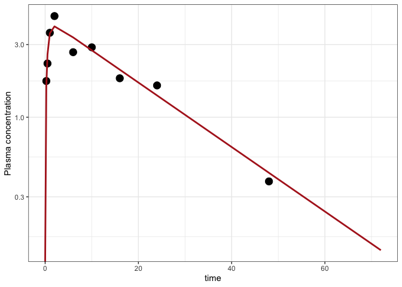
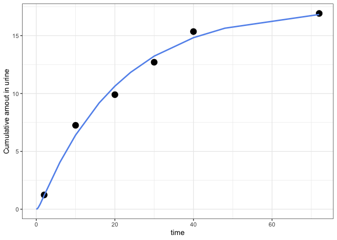

Fit a model with multiple endpoints
================

  - [Setup](#setup)
  - [Exploratory data analysis](#exploratory-data-analysis)
      - [Concentration versus time](#concentration-versus-time)
      - [Cumulative amount in urine versus
        time](#cumulative-amount-in-urine-versus-time)
  - [The model](#the-model)
  - [Assemble a model estimation data
    set](#assemble-a-model-estimation-data-set)
      - [Combine concentration and urine
        data](#combine-concentration-and-urine-data)
      - [Add a dosing record](#add-a-dosing-record)
  - [Estimate parameters: Approach I](#estimate-parameters-approach-i)
      - [Objective function](#objective-function)
      - [Optimize](#optimize)
      - [Results](#results)
  - [Estimate parameters: Approach II](#estimate-parameters-approach-ii)
      - [Some more data grooming](#some-more-data-grooming)
      - [The objective function](#the-objective-function)
      - [Optimize](#optimize-1)
      - [The results](#the-results)

# Setup

``` r
library(mrgsolve)
library(tidyverse)
theme_set(theme_bw())
```

# Exploratory data analysis

## Concentration versus time

We have plasma concentrations fairly early after the dose and running
out to 48 hours:

``` r
conc <- readRDS("two_endpoints_plasma.RDS")

conc
```

    . # A tibble: 9 x 3
    .      ID  time    CP
    .   <dbl> <dbl> <dbl>
    . 1     1  0.25 1.73 
    . 2     1  0.5  2.25 
    . 3     1  1    3.59 
    . 4     1  2    4.62 
    . 5     1  6    2.67 
    . 6     1 10    2.88 
    . 7     1 16    1.80 
    . 8     1 24    1.62 
    . 9     1 48    0.379

``` r
ggplot(conc, aes(time,CP)) + 
  geom_point() + geom_line() + 
  ylab("Plasma concentration") + ylim(0,5)
```

<!-- -->

## Cumulative amount in urine versus time

``` r
urine <- readRDS("two_endpoints_urine.RDS")

urine
```

    . # A tibble: 6 x 3
    .      ID  time    UR
    .   <dbl> <dbl> <dbl>
    . 1     1     2  1.23
    . 2     1    10  7.25
    . 3     1    20  9.90
    . 4     1    30 12.7 
    . 5     1    40 15.4 
    . 6     1    72 16.9

``` r
ggplot(urine, aes(time,UR)) + 
  geom_point() + geom_line() + 
  ylab("Cumulative amount in urine") + 
  xlim(0,48)
```

<!-- -->

# The model

The data above were simulated with this model, including the parameter
values you see below.

``` r
mod <- mread("two_endpoints.cpp")
```

``` c
[ SET ] end = 72, delta = 0.25, add = 0.05

[ PARAM ] CLnr = 0.97, V = 22.3, KA = 1.9, CLr = 0.2, dvtype = 0

[ CMT ] GUT CENT URINE

[ ODE ] 
dxdt_GUT   = -KA*GUT;
dxdt_CENT  =  KA*GUT - CLnr*(CENT/V) - CLr*(CENT/V);
dxdt_URINE =  CLr*(CENT/V); 

[ SIGMA ] 0 0

[ TABLE ] 
capture CP = (CENT/V)*exp(EPS(1));
capture UR = URINE*exp(EPS(2));
capture DV = dvtype ==2 ? UR : CP;
```

Check out the `[ TABLE ]` block. We check the value of `dvtype` and
return concentration if `dvtype==1` and urine amount if `dvtype==2`.

Note that there isn’t really a loss of generality here. You can still
simulate from the model as you wish. In order for `DV` to be meaningful,
you’ll have to use a data set with `dvtype` defined. But you could still
use this model to simulate any compartment / output at any time … just
ignore `DV` and access `CP` or `UR`.

# Assemble a model estimation data set

## Combine concentration and urine data

First, add a `DV` column to both data sets and set a flag for the type
of each `DV`

``` r
conc <-  mutate(conc,  DV = CP, dvtype = 1)
urine <- mutate(urine, DV = UR, dvtype = 2)
```

Then make a single data set sorted by time of observation

``` r
obs <- bind_rows(conc,urine) %>% arrange(time)
```

No longer need `CP` or `UR`

``` r
obs <- select(obs,ID,time,dvtype,DV)
```

And we’ll add some columns that to make mrgsolve happy; this is the
observations part of the data set

``` r
obs <- mutate(obs, evid = 0, cmt = 0, amt = 0)

obs
```

    . # A tibble: 15 x 7
    .       ID  time dvtype     DV  evid   cmt   amt
    .    <dbl> <dbl>  <dbl>  <dbl> <dbl> <dbl> <dbl>
    .  1     1  0.25      1  1.73      0     0     0
    .  2     1  0.5       1  2.25      0     0     0
    .  3     1  1         1  3.59      0     0     0
    .  4     1  2         1  4.62      0     0     0
    .  5     1  2         2  1.23      0     0     0
    .  6     1  6         1  2.67      0     0     0
    .  7     1 10         1  2.88      0     0     0
    .  8     1 10         2  7.25      0     0     0
    .  9     1 16         1  1.80      0     0     0
    . 10     1 20         2  9.90      0     0     0
    . 11     1 24         1  1.62      0     0     0
    . 12     1 30         2 12.7       0     0     0
    . 13     1 40         2 15.4       0     0     0
    . 14     1 48         1  0.379     0     0     0
    . 15     1 72         2 16.9       0     0     0

## Add a dosing record

Just like we did in the `Indometh` example, pull a single row and set up
the dosing

``` r
dose <- obs %>% slice(1)

dose
```

    . # A tibble: 1 x 7
    .      ID  time dvtype    DV  evid   cmt   amt
    .   <dbl> <dbl>  <dbl> <dbl> <dbl> <dbl> <dbl>
    . 1     1  0.25      1  1.73     0     0     0

Now, set up this chunk to be doses (not observations)

``` r
dose <- mutate(dose, time = 0, amt = 100, evid = 1, cmt = 1)
```

We make this `dvtype` 0 and set `DV` to `NA` (it is dosing record so we
don’t want this to contribute information to parameter estimates)

``` r
dose <- mutate(dose, dvtype = 0, DV = NA)
```

Then bind it all together and arrange

``` r
data <- bind_rows(obs,dose) %>% arrange(time)

data
```

    . # A tibble: 16 x 7
    .       ID  time dvtype     DV  evid   cmt   amt
    .    <dbl> <dbl>  <dbl>  <dbl> <dbl> <dbl> <dbl>
    .  1     1  0         0 NA         1     1   100
    .  2     1  0.25      1  1.73      0     0     0
    .  3     1  0.5       1  2.25      0     0     0
    .  4     1  1         1  3.59      0     0     0
    .  5     1  2         1  4.62      0     0     0
    .  6     1  2         2  1.23      0     0     0
    .  7     1  6         1  2.67      0     0     0
    .  8     1 10         1  2.88      0     0     0
    .  9     1 10         2  7.25      0     0     0
    . 10     1 16         1  1.80      0     0     0
    . 11     1 20         2  9.90      0     0     0
    . 12     1 24         1  1.62      0     0     0
    . 13     1 30         2 12.7       0     0     0
    . 14     1 40         2 15.4       0     0     0
    . 15     1 48         1  0.379     0     0     0
    . 16     1 72         2 16.9       0     0     0

# Estimate parameters: Approach I

## Objective function

``` r
ofv1 <- function(p, data, yobs, dvcol = "DV", pred=FALSE) {
  p <- lapply(p, exp)
  names(p) <- names(theta)
  mod <- param(mod,p)
  out <- mrgsim_d(mod, data, output="df")
  if(pred) return(as_tibble(out))
  y_hat <- out[[dvcol]]
  sum((y_hat-yobs)^2,na.rm=TRUE)
}
```

## Optimize

``` r
yobs <- data[["DV"]]

theta <- log(c(CLnr = 2, V=10, KA = 1, CLr = 1))

fit <- minqa::newuoa(theta, ofv1, data=data, yobs=yobs)
```

## Results

The way we set this up, the true parameters are in the model

``` r
as.numeric(param(mod))
```

    .   CLnr      V     KA    CLr dvtype 
    .   0.97  22.30   1.90   0.20   0.00

``` r
exp(fit$par)
```

    . [1]  0.9165103 23.1198956  1.8864036  0.1937363

And make the plots for concentration and urine cumulative amount; we use
the `dose` data set (above) to get the smooth line

``` r
prd <- ofv1(fit$par,data = dose, pred = TRUE)
```

``` r
ggplot() + 
  geom_point(data=conc, aes(time,CP), size = 4) + 
  geom_line(data=prd, aes(time,CP),col="firebrick", lwd=1) +
  scale_y_log10() + ylab("Plasma concentration")
```

<!-- -->

``` r
ggplot() + 
  geom_point(data= urine, aes(time,UR), size = 4) + 
  geom_line(data=prd, aes(time,UR),col="cornflowerblue", lwd=1) +
   ylab("Cumulative amout in urine")
```

<!-- -->

# Estimate parameters: Approach II

I still think approach I is simpler and easier to pull off without loss
of flexibility for simulation.

But if you didn’t want to do the `DV` approach, here is another way.

## Some more data grooming

First, find which rows are type 1 (concentration) and which are type 2
(urine):

``` r
iconc <- which(data$dvtype==1)
iur   <- which(data$dvtype==2)
```

So we can use this `iur` vector to grab just the urine amounts

``` r
iur
```

    . [1]  6  9 11 13 14 16

``` r
data[iur,]
```

    . # A tibble: 6 x 7
    .      ID  time dvtype    DV  evid   cmt   amt
    .   <dbl> <dbl>  <dbl> <dbl> <dbl> <dbl> <dbl>
    . 1     1     2      2  1.23     0     0     0
    . 2     1    10      2  7.25     0     0     0
    . 3     1    20      2  9.90     0     0     0
    . 4     1    30      2 12.7      0     0     0
    . 5     1    40      2 15.4      0     0     0
    . 6     1    72      2 16.9      0     0     0

Now, create a vector of all the concentrations followed by all the urine
amounts; the final product is `yobs`

``` r
yplas <- data$DV[iconc]
yur   <- data$DV[iur]
yobs  <- c(yplas,yur)
```

## The objective function

The OFV function will now have to modified as well

``` r
ofv2 <- function(p,data,pred=FALSE) {
  p <- lapply(p, exp)
  names(p) <- names(theta)
  mod <- param(mod,p)
  out <- mrgsim_d(mod,data)
  if(pred) return(as_tibble(out))
  
  ## The action is here:
  yplas_hat <- out$CP[iconc]
  yur_hat   <- out$UR[iur]
  y_hat     <- c(yplas_hat,yur_hat)
  ##---------------------------
  
  sum((y_hat-yobs)^2)
}
```

The function is mostly the same, but now we’ll slice the simulation
output to first grab the concentrations and then grab the urine
concentrations. **NOTE**: this works because the simulation output has
the exact same design / setup as the input data. So we slice both the
input data and the output by the same indices so we can be sure the
observed and simulated values match up.

## Optimize

Ok, now try it out:

``` r
theta <- log(c(CLnr = 2, V =12, KA = 1, CLr = 1))

fit <- minqa::newuoa(par=theta, fn=ofv2, data=data)
```

## The results

``` r
as.numeric(param(mod))
```

    .   CLnr      V     KA    CLr dvtype 
    .   0.97  22.30   1.90   0.20   0.00

``` r
exp(fit$par)
```

    . [1]  0.9165441 23.1189119  1.8859076  0.1937382

And plot

``` r
prd <- ofv2(fit$par,data = dose, pred = TRUE)

ggplot() + 
  geom_point(data= data[iconc,], aes(time,DV), size = 4) + 
  geom_line(data=prd, aes(time,CP),col="firebrick", lwd=1) +
  scale_y_log10() + ylab("Plasma concentration")
```

<!-- -->

``` r
ggplot() + 
  geom_point(data= data[iur,], aes(time,DV), size = 4) + 
  geom_line(data=prd, aes(time,UR),col="cornflowerblue", lwd=1) +
  ylab("Cumulative amout in urine")
```

<!-- -->
