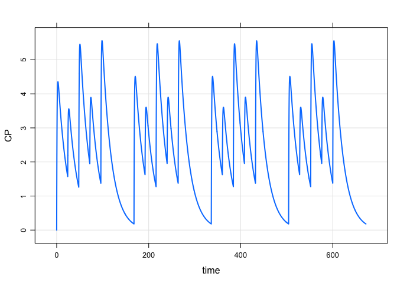

Generating input data sets for mrgsolve
================

``` r
library(mrgsolve)
library(dplyr)
```

## Input data sets

An important mechanism for creating robust, complex simulations is the
input data set. Input data sets specify the population of individuals to
simulate, including the number of individuals, each individual’s dosing
interventions, each individual’s covariate values etc. The input data
set is just a plain old `R` `data.frame`, but with some expectations
about which columns are present and expectations for how to handle
columns for certain names. For example, every input data set has to have
an `ID`, `time`, and `cmt` column. Note that either lower case names
(like `time` and `cmt`) are acceptable as are upper case names (like
`TIME` and `CMT`). But users are not to mix upper and lower case names
(like `time` and `CMT`) for certain column names related to dosing
events. The help topic `?data_set` discusses more about what the
expectations are for input data sets.

## Functions to generate input data sets

`mrgsolve` provides several functions and workflows to help you put
together the right input data set for your simulation. The main point of
this blog post is to review some of these functions to help you better
organize your `mrgsolve` simulations. Some functions are very simple and
you might not find a function to do **exactly** what you want to do. But
we’ve found these functions to be helpful to accomplish tasks that we
found ourselves repeating over and over … and thus these tasks were
formalized in a function. Just keep in mind that input data sets are
just `data.frames` … you can use any code or any function (even your
own\!) to do tasks similar to what these functions are doing.

### `expand.ev`

`expand.ev` is like `expand.grid`: it creates a single `data.frame` with
all combinations of it’s vector arguments. It’s pretty simple but
convenient to have. For example,

``` r
data <- expand.ev(amt=c(100,200,300), ID=1:3)
data
```

    .   ID amt evid cmt time
    . 1  1 100    1   1    0
    . 2  2 200    1   1    0
    . 3  3 300    1   1    0
    . 4  4 100    1   1    0
    . 5  5 200    1   1    0
    . 6  6 300    1   1    0
    . 7  7 100    1   1    0
    . 8  8 200    1   1    0
    . 9  9 300    1   1    0

This function call gives us 3 individuals at each of 3 doses. The
`expand.grid` nature of `expand.ev` is what gives us `3x3=9` rows in the
data set. Notice that the `IDs` are now 1 through 9 … `expand.ev`
renumbers `IDs` so that there is only one dosing event per row and there
is on row per `ID`.

Also notice that `time` defaults to 0, `evid` defaults to 1, and `cmt`
defaults to 1. So, `expand.ev` fills in some of the required columns for
you.

Let’s simulate with this data set:

``` r
mod <- mrgsolve:::house() %>% Req(CP) 
mod %>% 
  mrgsim(data=data) %>% 
  plot(CP~time|factor(ID),scales="same")
```

<!-- -->

### `as_data_set`

This function allows you to combine several event objects into a single
data sets. An example works best to illustrate.

First, create three event objects. Let’s try one `ID` at 100 mg, two
`IDs` at 200 mg, and 3 `IDs` at 300 mg.

``` r
e1 <- ev(amt=100, ID=1)
e2 <- ev(amt=200, ID=1:2)
e3 <- ev(amt=300, ID=1:3)
```

The events are

``` r
e1
```

    . Events:
    .   ID time cmt amt evid
    . 1  1    0   1 100    1

and

``` r
e2
```

    . Events:
    .   ID time cmt amt evid
    . 1  1    0   1 200    1
    . 2  2    0   1 200    1

and

``` r
e3
```

    . Events:
    .   ID time cmt amt evid
    . 1  1    0   1 300    1
    . 2  2    0   1 300    1
    . 3  3    0   1 300    1

When we combine these events with `as_data_set` we get

``` r
data <- as_data_set(e1,e2,e3)
data
```

    .   ID time cmt evid amt
    . 1  1    0   1    1 100
    . 2  2    0   1    1 200
    . 3  3    0   1    1 200
    . 4  4    0   1    1 300
    . 5  5    0   1    1 300
    . 6  6    0   1    1 300

A nice feature of `as_data_set` is, unlike `expand.ev` and the previous
example, we can use complicated event sequences that are expressed with
more than one line in the data set. For example, consider the case where
every `ID` gets a 250 mg loading dose, and then either get 250 mg q24h,
or 120 mg q12h or 500 mg q48h.

``` r
load <- function(n) ev(amt=250, ID=1:n)
e1 <- load(1) + ev(amt=250, time=24, ii=24, addl=3, ID=1)
e2 <- load(2) + ev(amt=125, time=24, ii=12, addl=7, ID=1:2)
e3 <- load(3) + ev(amt=500, time=24, ii=48, addl=1, ID=1:3)
```

Now, `e1`, `e2`, and `e3` are more complex

``` r
e1
```

    . Events:
    .   ID time cmt amt evid ii addl
    . 1  1    0   1 250    1  0    0
    . 2  1   24   1 250    1 24    3

``` r
e3
```

    . Events:
    .   ID time cmt amt evid ii addl
    . 1  1    0   1 250    1  0    0
    . 4  1   24   1 500    1 48    1
    . 2  2    0   1 250    1  0    0
    . 5  2   24   1 500    1 48    1
    . 3  3    0   1 250    1  0    0
    . 6  3   24   1 500    1 48    1

But, we can still pull them together in one single data set

``` r
data <- as_data_set(e1,e2,e3)
data
```

    .    ID time cmt evid amt ii addl
    . 1   1    0   1    1 250  0    0
    . 2   1   24   1    1 250 24    3
    . 3   2    0   1    1 250  0    0
    . 4   2   24   1    1 125 12    7
    . 5   3    0   1    1 250  0    0
    . 6   3   24   1    1 125 12    7
    . 7   4    0   1    1 250  0    0
    . 8   4   24   1    1 500 48    1
    . 9   5    0   1    1 250  0    0
    . 10  5   24   1    1 500 48    1
    . 11  6    0   1    1 250  0    0
    . 12  6   24   1    1 500 48    1

An example simulation

``` r
set.seed(1112)
mod %>% 
  omat(dmat(1,1,1,1)/10) %>% 
  data_set(data) %>% 
  mrgsim() %>% 
  plot
```

<!-- -->

### `as.data.frame.ev`

Just a quick reminder here that you can easily convert between a single
event object and a `data.frame`

``` r
as.data.frame(e3)
```

    .   ID time cmt amt evid ii addl
    . 1  1    0   1 250    1  0    0
    . 4  1   24   1 500    1 48    1
    . 2  2    0   1 250    1  0    0
    . 5  2   24   1 500    1 48    1
    . 3  3    0   1 250    1  0    0
    . 6  3   24   1 500    1 48    1

``` r
as.ev(as.data.frame(e3))
```

    . Events:
    .   ID time cmt amt evid ii addl
    . 1  1    0   1 250    1  0    0
    . 4  1   24   1 500    1 48    1
    . 2  2    0   1 250    1  0    0
    . 5  2   24   1 500    1 48    1
    . 3  3    0   1 250    1  0    0
    . 6  3   24   1 500    1 48    1

So if you were building up an event object and just wanted to use it as
a `data_set` or as a building block for a `data_set`, just coerce with
`as.data.frame`.

### `assign_ev`

This function assigns an intervention in the form of an event object to
individuals in an `idata_set` according to a grouping column.

To illustrate, make a simple `idata_set`

``` r
set.seed(8)
idata <- data_frame(ID=sample(1:6), arm=c(1,2,2,3,3,3))
```

    . Warning: `data_frame()` is deprecated, use `tibble()`.
    . This warning is displayed once per session.

``` r
idata
```

    . # A tibble: 6 x 2
    .      ID   arm
    .   <int> <dbl>
    . 1     4     1
    . 2     2     2
    . 3     3     2
    . 4     6     3
    . 5     5     3
    . 6     1     3

Here, we have 6 `IDs`, one in arm 1, two in arm 2, three in arm 3. Let’s
take the events from the previous example and assign them to the
different arms.

``` r
e1 <- ev(amt=250) + ev(amt=250, time=24, ii=24, addl=3)
e2 <- ev(amt=250) + ev(amt=125, time=24, ii=12, addl=7)
e3 <- ev(amt=250) + ev(amt=500, time=24, ii=48, addl=1)
assign_ev(list(e3,e2,e1),idata,"arm")
```

    .    time cmt amt evid ii addl ID
    . 1     0   1 250    1  0    0  4
    . 2    24   1 500    1 48    1  4
    . 3     0   1 250    1  0    0  2
    . 4    24   1 125    1 12    7  2
    . 5     0   1 250    1  0    0  3
    . 6    24   1 125    1 12    7  3
    . 7     0   1 250    1  0    0  6
    . 8    24   1 250    1 24    3  6
    . 9     0   1 250    1  0    0  5
    . 10   24   1 250    1 24    3  5
    . 11    0   1 250    1  0    0  1
    . 12   24   1 250    1 24    3  1

Please look carefully at the input (`idata` and `list(e3,e2,e1)`); I
have mixed it up a bit here to try to illustrate how things are
assigned.

### `ev_days`

This is a recently-added function (hint: you might need to install the
latest version from GitHub to use this) that lets you schedule certain
events on certain days of the week, repeating in a weekly cycle.

For example, to schedule 250 mg doses every Monday, Wednesday, and
Friday for a month, you can do

``` r
data <- ev_days(ev(amt=250, ID=1), days="m,w,f", addl=3)
data
```

    .   ID time cmt amt evid  ii addl
    . 1  1    0   1 250    1 168    3
    . 2  1   48   1 250    1 168    3
    . 3  1   96   1 250    1 168    3

``` r
mod %>% mrgsim(data=data,end=168*4) %>% plot
```

<!-- -->

Or, you can do 100 mg doses on Monday, Wednesday, Friday, and 50 mg
doses on Tuesday, Thursday, with drug holiday on weekends

``` r
e1 <- ev(amt=100,ID=1)
e2 <- ev(amt=50,ID=1)
data <- ev_days(m=e1,w=e1,f=e1,t=e2,th=e2,addl=3)
data
```

    .   ID time cmt amt evid  ii addl
    . 1  1    0   1 100    1 168    3
    . 2  1   24   1  50    1 168    3
    . 3  1   48   1 100    1 168    3
    . 4  1   72   1  50    1 168    3
    . 5  1   96   1 100    1 168    3

And simulate

``` r
mod %>% mrgsim(data=data,end=168*4) %>% plot
```

<!-- -->

The same thing can be accomplished like this

``` r
a <- ev_days(e1,days="m,w,f",addl=3)
b <- ev_days(e2,days="t,th",addl=3)

c(as.ev(a),as.ev(b))
```

    . Events:
    .   ID time cmt amt evid  ii addl
    . 1  1    0   1 100    1 168    3
    . 4  1   24   1  50    1 168    3
    . 2  1   48   1 100    1 168    3
    . 5  1   72   1  50    1 168    3
    . 3  1   96   1 100    1 168    3

You can use this as an event object or just coerce to `data.frame` to
use as a `data_set`.

<hr>

## Filter input data set inline

Remember, when you pass in your input data set via `data_set`, you can
filter in line:

``` r
data <- expand.ev(amt=c(100,200,300))
mod %>% data_set(data, amt==300) %>% Req(GUT,CP) %>% mrgsim
```

    . Model:  housemodel 
    . Dim:    482 x 4 
    . Time:   0 to 120 
    . ID:     1 
    .     ID time    GUT     CP
    . 1:   3 0.00   0.00  0.000
    . 2:   3 0.00 300.00  0.000
    . 3:   3 0.25 222.25  3.862
    . 4:   3 0.50 164.64  6.676
    . 5:   3 0.75 121.97  8.712
    . 6:   3 1.00  90.36 10.174
    . 7:   3 1.25  66.94 11.211
    . 8:   3 1.50  49.59 11.934
