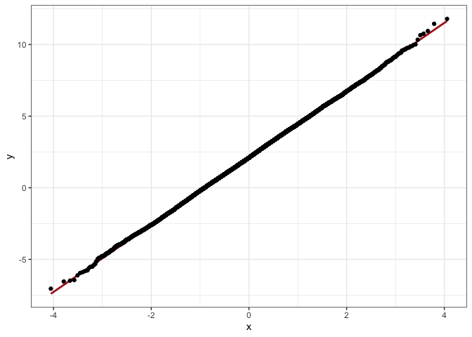

Sigma-Like THETA
================

``` r
library(tidyverse)
library(mrgsolve)
```

In this model, we will model the residual error variances with
parameters (or THETAs) rather than SIGMAs. We will also model RUV in the
standard way (using SIGMAs) so we can compare.

## In the model

  - parameter `THETA10` is proportional error
  - parameter `THETA11` is additive error
  - `SIGMA` 1 is equivalent to `THETA10` (proportional error)
  - `SIGMA` 2 is equivalent to `THETA11` (additive error)
  - `SIGMA` 3 would be fixed to 1 in the NONMEM run (here, just set to
    1)

<!-- end list -->

``` r
code <- ' 
$PARAM THETA10 = 0.025,  THETA11 = 5, CL = 1, V = 25

$PKMODEL cmt = "CENT"

$SIGMA 0.025 5

$SIGMA 1 // "FIXED"

$TABLE
capture IPRED = CENT/V;

double W = sqrt(THETA11 + THETA10*pow(IPRED,2.0));

capture DV = IPRED + W*EPS(3);

capture DV2 = IPRED*(1+EPS(1)) + EPS(2);
'
```

**Compile**

``` r
mod <- mcode("sigma-like-theta", code, delta = 0.5, end = 10000) 
```

**Simulate**

``` r
out <- mrgsim_df(mod, events = ev(amt = 50, ii = 24, addl = 10000))
```

**Check**

``` r
head(out)
```

    .   ID time     CENT    IPRED         DV        DV2
    . 1  1  0.0  0.00000 0.000000 -1.8114779  1.6216986
    . 2  1  0.0 50.00000 2.000000  0.1704970  3.6171189
    . 3  1  0.5 49.00993 1.960397  4.2408000 -0.5652477
    . 4  1  1.0 48.03947 1.921579 -0.8742132 -3.6958783
    . 5  1  1.5 47.08823 1.883529  5.7868131  3.8049866
    . 6  1  2.0 46.15582 1.846233 -1.8632656  4.0256672

**Plot**

``` r
library(ggplot2)
p <- ggplot(out, aes(sample = DV, distribution = DV2)) +  theme_bw()
p + stat_qq_line(col = "firebrick", lwd = 1) + stat_qq() 
```

<!-- -->

**Summarise**

``` r
out %>% 
  pivot_longer(cols = DV:DV2) %>% 
  group_by(name) %>% 
  summarise(tibble(mean = mean(value), SD = sd(value)), n = n())
```

    . # A tibble: 2 x 4
    .   name   mean    SD     n
    .   <chr> <dbl> <dbl> <int>
    . 1 DV     2.11  2.33 20002
    . 2 DV2    2.10  2.33 20002
