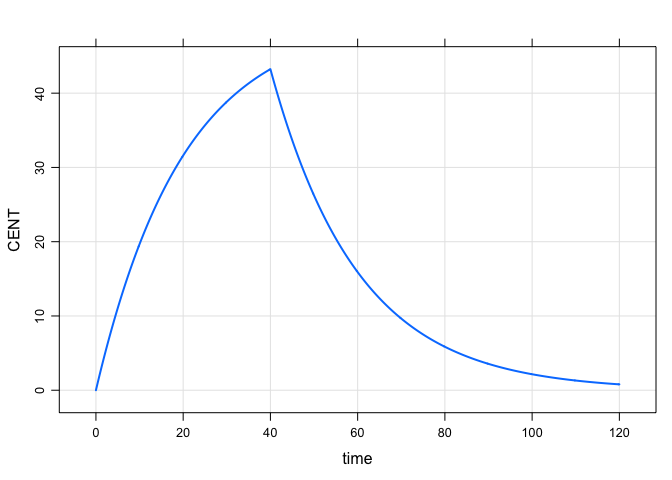
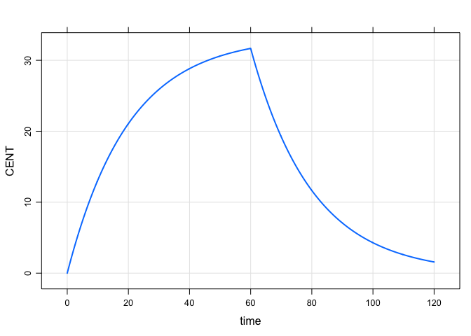

Model infusion rate or duration
================

``` r
library(mrgsolve)
```

Model the rate
--------------

-   We use `R_CENT` to model the infusion rate into the `CENT`ral
    compartment
-   The nonmem equivalent for this example would be `R1`

``` r
code <- '
$PARAM CL = 1, V = 20, inf_RATE = 2.5

$MAIN
R_CENT = inf_RATE;

$PKMODEL cmt = "CENT"
'
```

``` r
mod <- mcode("model_rate", code) %>% 
  update(end = 120, delta = 0.1)
```

``` r
mod %>% ev(amt = 100, rate = -1) %>% 
  mrgsim %>% plot
```



Model the duration
------------------

-   We use `D_CENT` to model the infusion duration into the `CENT`ral
    compartment
-   The nonmem equivalent for this example would be `D1`

``` r
code <- '
$PARAM CL = 1, V = 20, inf_DUR = 60

$MAIN
D_CENT = inf_DUR;

$PKMODEL cmt = "CENT"

'
```

``` r
mod <- mcode("model_duration", code) %>% 
  update(end = 120, delta = 0.1)
```

``` r
mod %>% ev(amt = 100, rate = -2) %>% 
  mrgsim %>% plot
```


