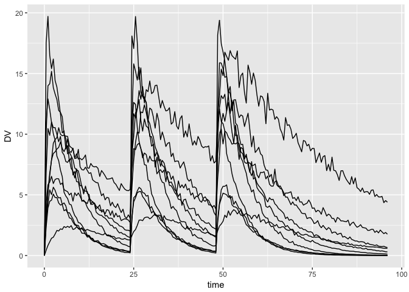

Simulate from bootstrap estimates
================

-   [Load an example model](#load-an-example-model)
-   [Example bootstrap output](#example-bootstrap-output)
-   [Helper functions for matrices](#helper-functions-for-matrices)
    -   [Create a list of `$OMEGA` and `$SIGMA` matrices](#create-a-list-of-omega-and-sigma-matrices)
-   [Simulate](#simulate)
-   [Simulate with only uncertainty in the `THETA`s](#simulate-with-only-uncertainty-in-the-thetas)
-   [Session Info](#session-info)

``` r
library(mrgsolve)
library(dplyr)
library(ggplot2)
```

Load an example model
=====================

You can see the model source [here](bootstrap.cpp)

``` r
mod <- mread("bootstrap")
```

We have `THETA1`, `THETA2`, and `THETA3` in `$PARAM`

``` r
param(mod)
```

    . 
    .  Model parameters (N=4):
    .  name   value . name   value
    .  THETA1 1     | THETA3 0.5  
    .  THETA2 24    | WT     70

We have a 3x3 `$OMEGA` matrix

``` r
omat(mod)
```

    . $...
    .       [,1] [,2] [,3]
    . ECL:   0.3  0.0  0.0
    . EV:    0.0  0.1  0.0
    . EKA:   0.0  0.0  0.5

and a 1x1 `$SIGMA` matrix

``` r
smat(mod)
```

    . $...
    .     [,1]
    . 1:     0

Example bootstrap output
========================

The example assumes that the different estimates are in columns and the different boostrap runs are each in a separate row of a data frame.

``` r
data(exBoot)
head(exBoot)
```

    .   run  THETA1 THETA2  THETA3 OMEGA11   OMEGA21 OMEGA22 OMEGA31  OMEGA32
    . 1   1 -0.7634  2.280  0.8472 0.12860  0.046130  0.2874 0.13820 -0.02164
    . 2   2 -0.4816  2.076  0.5355 0.12000  0.051000  0.2409 0.06754 -0.07759
    . 3   3 -0.5865  2.334 -0.4597 0.11460  0.097150  0.2130 0.16650  0.18100
    . 4   4 -0.6881  1.824  0.7736 0.14990  0.000003  0.2738 0.24700 -0.05466
    . 5   5  0.2909  1.519 -1.2440 0.07308  0.003842  0.2989 0.06475  0.05078
    . 6   6  0.1135  2.144 -1.0040 0.13390 -0.019270  0.1640 0.10740 -0.01170
    .   OMEGA33  SIGMA11 SIGMA21 SIGMA22
    . 1  0.3933 0.002579       0  1.0300
    . 2  0.3342 0.002228       0  1.0050
    . 3  0.4699 0.002418       0  1.0890
    . 4  0.5536 0.002177       0  0.8684
    . 5  0.2500 0.001606       0  0.8996
    . 6  0.3412 0.002134       0  0.9744

**NOTE** mrgsolve has some functions to help you deal with output that is in this `NONMEM` type format; for `OMEGA`, it is expecting `OMEGA11`, then `OMEGA21` then `OMEGA22` then `OMEGA31` etc. Below, find some functions to go into this data frame to make R matrices that you can pass to the model.

I know that PsN can return these data in a different order. I don't know enough about how it is structured to write something that will always handle properly and in a convenient way. So there if you're using PsN, there is a chance you will have to code some of this by hand. If that is a case, I'm looking for a PsN-using collaborator who could help us understand / predict the output so we could automate.

Helper functions for matrices
=============================

Create a list of `$OMEGA` and `$SIGMA` matrices
-----------------------------------------------

Create a list of `OMEGA` matrices; the function looks for column names in `exBoot` that contains `OMEGA`

``` r
omegas <- as_bmat(exBoot, "OMEGA")
```

``` r
omegas[[10]]
```

    .         [,1]    [,2]    [,3]
    . [1,] 0.10830 0.05516 0.14330
    . [2,] 0.05516 0.23430 0.08746
    . [3,] 0.14330 0.08746 0.41730

``` r
length(omegas)
```

    . [1] 100

You can also just go after a single row

``` r
as_bmat(exBoot[1,], "OMEGA")
```

    . [[1]]
    .         [,1]     [,2]     [,3]
    . [1,] 0.12860  0.04613  0.13820
    . [2,] 0.04613  0.28740 -0.02164
    . [3,] 0.13820 -0.02164  0.39330

Do this for `SIGMA` too; I only had one `EPS` in the simulation model, so I'm going to look for `SIGMA11` only to get a 1x1 matrix

``` r
sigmas <- as_bmat(exBoot, "SIGMA11")

sigmas[[10]]
```

    .          [,1]
    . [1,] 0.001869

Simulate
========

1.  The `param` call scrapes the `THETA`s from `exBoot`; this works because `THETA1`, `THETA2`, and `THETA3` are listed in `$PARAM`
2.  Use `omat` to update the `$OMEGA` matrix; this works because `$OMEGA` is a 3x3 matrix
3.  Use `smat` to update the `$SIGMA` matrix

``` r
set.seed(222)

out <- lapply(1:10, function(i) {
  
  mod %>%
    param(exBoot[i,]) %>%
    omat(omegas[[i]]) %>%
    smat(sigmas[[i]]) %>%
    ev(amt = 100, ii = 24, addl = 2) %>%
    mrgsim(Req = "DV", end = 96) %>%
    mutate(rep = i)
  
}) %>% bind_rows
```

``` r
ggplot(out, aes(time,DV,group=rep)) + geom_line()
```



Simulate with only uncertainty in the `THETA`s
==============================================

All the uncertainty comes from the bootstrap `THETA`s

``` r
set.seed(222)

out <- lapply(1:10, function(i) {
  
  mod %>%
    param(exBoot[i,]) %>%
    zero_re() %>%
    ev(amt = 100, ii = 24, addl = 2) %>%
    mrgsim(Req = "DV", end = 96) %>%
    mutate(rep = i)
  
}) %>% bind_rows
```

``` r
ggplot(out, aes(time,DV,group=rep)) + geom_line()
```


Session Info
============

``` r
devtools::session_info()
```

    . Session info -------------------------------------------------------------

    .  setting  value                       
    .  version  R version 3.4.2 (2017-09-28)
    .  system   x86_64, darwin15.6.0        
    .  ui       X11                         
    .  language (EN)                        
    .  collate  en_US.UTF-8                 
    .  tz       America/New_York            
    .  date     2018-01-25

    . Packages -----------------------------------------------------------------

    .  package       * version     date       source                         
    .  assertthat      0.2.0       2017-04-11 CRAN (R 3.4.0)                 
    .  backports       1.1.1       2017-09-25 CRAN (R 3.4.1)                 
    .  base          * 3.4.2       2017-10-04 local                          
    .  bindr           0.1         2016-11-13 CRAN (R 3.4.0)                 
    .  bindrcpp        0.2         2017-06-17 cran (@0.2)                    
    .  colorspace      1.3-2       2016-12-14 CRAN (R 3.4.0)                 
    .  compiler        3.4.2       2017-10-04 local                          
    .  datasets      * 3.4.2       2017-10-04 local                          
    .  devtools        1.13.3      2017-08-02 CRAN (R 3.4.2)                 
    .  digest          0.6.13      2017-12-14 cran (@0.6.13)                 
    .  dplyr         * 0.7.4       2017-09-28 CRAN (R 3.4.2)                 
    .  evaluate        0.10.1      2017-06-24 CRAN (R 3.4.0)                 
    .  ggplot2       * 2.2.1       2016-12-30 CRAN (R 3.4.0)                 
    .  glue            1.2.0.9000  2018-01-12 Github (tidyverse/glue@1592ee1)
    .  graphics      * 3.4.2       2017-10-04 local                          
    .  grDevices     * 3.4.2       2017-10-04 local                          
    .  grid            3.4.2       2017-10-04 local                          
    .  gtable          0.2.0       2016-02-26 CRAN (R 3.4.0)                 
    .  htmltools       0.3.6       2017-04-28 CRAN (R 3.4.0)                 
    .  knitr           1.18        2017-12-27 cran (@1.18)                   
    .  labeling        0.3         2014-08-23 CRAN (R 3.4.0)                 
    .  lazyeval        0.2.1       2017-10-29 cran (@0.2.1)                  
    .  magrittr        1.5         2014-11-22 CRAN (R 3.4.0)                 
    .  memoise         1.1.0       2017-04-21 CRAN (R 3.4.0)                 
    .  methods       * 3.4.2       2017-10-04 local                          
    .  mrgsolve      * 0.8.10.9005 2018-01-22 local                          
    .  munsell         0.4.3       2016-02-13 CRAN (R 3.4.0)                 
    .  pkgconfig       2.0.1       2017-03-21 CRAN (R 3.4.0)                 
    .  plyr            1.8.4       2016-06-08 CRAN (R 3.4.0)                 
    .  R6              2.2.2       2017-06-17 CRAN (R 3.4.0)                 
    .  Rcpp            0.12.14     2017-11-23 cran (@0.12.14)                
    .  RcppArmadillo   0.8.100.1.0 2017-10-11 CRAN (R 3.4.2)                 
    .  rlang           0.1.6       2017-12-21 cran (@0.1.6)                  
    .  rmarkdown       1.8         2017-11-17 cran (@1.8)                    
    .  rprojroot       1.2         2017-01-16 CRAN (R 3.4.0)                 
    .  scales          0.5.0       2017-08-24 CRAN (R 3.4.1)                 
    .  stats         * 3.4.2       2017-10-04 local                          
    .  stringi         1.1.5       2017-04-07 CRAN (R 3.4.2)                 
    .  stringr         1.2.0       2017-02-18 CRAN (R 3.4.2)                 
    .  tibble          1.3.4       2017-08-22 CRAN (R 3.4.1)                 
    .  tools           3.4.2       2017-10-04 local                          
    .  utils         * 3.4.2       2017-10-04 local                          
    .  withr           2.1.0.9000  2017-12-16 Github (r-lib/withr@fe81c00)   
    .  yaml            2.1.16      2017-12-12 CRAN (R 3.4.2)
