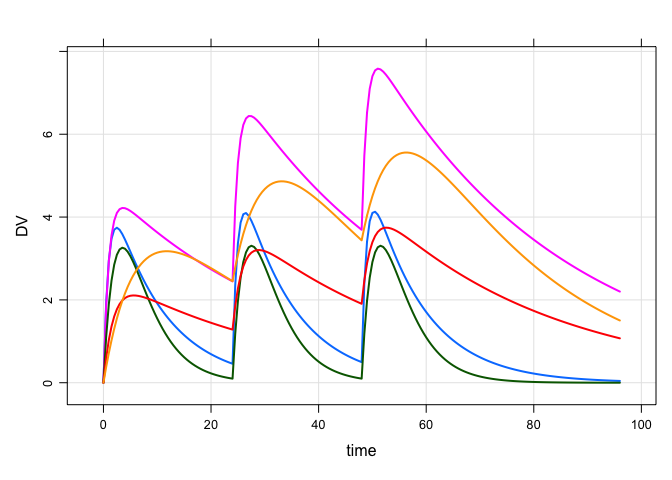

Simulate from bootstrap estimates
================

  - [Scope and source code](#scope-and-source-code)
  - [Load an example model](#load-an-example-model)
  - [Generate an example data
    template](#generate-an-example-data-template)
      - [Test simulation](#test-simulation)
  - [Example bootstrap output](#example-bootstrap-output)
  - [Helper functions for matrices](#helper-functions-for-matrices)
      - [Create a list of `$OMEGA` and `$SIGMA`
        matrices](#create-a-list-of-omega-and-sigma-matrices)
  - [Simulate](#simulate)
  - [Simulate with only uncertainty in the
    `THETA`s](#simulate-with-only-uncertainty-in-the-thetas)
  - [Session Info](#session-info)

# Scope and source code

This document demonstrates how to use an mrgsolve model and bootstrap
parameter estiamtes to create replicate simulations that incorporate
uncertainty in the fixed effect (e.g. `THETA`) and random effect (e.g.
`OMEGA` and `SIGMA`) parameters.

**Source code**

The example code for this document can be reached [here](bootstrap.Rmd)
and the example model [here](bootstrap.cpp). The bootstrap data set is
bundled with the mrgsolve package.

**Required packages**

``` r
library(mrgsolve)
library(dplyr)
library(ggplot2)
```

# Load an example model

You can see the model source [here](bootstrap.cpp)

``` r
mod <- mread("bootstrap")
```

We have `THETA1`, `THETA2`, and `THETA3` in `$PARAM`

``` r
param(mod)
```

    . 
    .  Model parameters (N=4):
    .  name   value . name   value 
    .  THETA1 0     | THETA3 -0.693
    .  THETA2 3.18  | WT     70

We have a 3x3 `$OMEGA` matrix

``` r
omat(mod)
```

    . $...
    .       [,1] [,2] [,3]
    . ECL:   0.3  0.0  0.0
    . EV:    0.0  0.1  0.0
    . EKA:   0.0  0.0  0.5

and a 1x1 `$SIGMA` matrix

``` r
smat(mod)
```

    . $...
    .     [,1]
    . 1:     0

# Generate an example data template

``` r
data <- ev_rep(ev(amt = 100, ii = 24, addl = 2), ID = 1:5)
```

100 mg daily x3 in 5 individuals

``` r
data
```

    .   time cmt amt evid ii addl ID
    . 1    0   1 100    1 24    2  1
    . 2    0   1 100    1 24    2  2
    . 3    0   1 100    1 24    2  3
    . 4    0   1 100    1 24    2  4
    . 5    0   1 100    1 24    2  5

## Test simulation

The basic simulation we will be doing is

``` r
set.seed(987652)

mod %>%
  data_set(data) %>%
  mrgsim(Req = "DV", end = 96)  %>% 
  plot()
```

<!-- -->

Just three doses, simulating out to 96 hours. From here, we will do this
test simulation for several replicates, with each replicate drawing a
different set of bootstrap parameters.

# Example bootstrap output

The example assumes that the different estimates are in columns and the
different boostrap runs are each in a separate row of a data frame.

``` r
data(exBoot)
head(exBoot)
```

    .   run  THETA1 THETA2  THETA3 OMEGA11   OMEGA21 OMEGA22 OMEGA31  OMEGA32
    . 1   1 -0.7634  2.280  0.8472 0.12860  0.046130  0.2874 0.13820 -0.02164
    . 2   2 -0.4816  2.076  0.5355 0.12000  0.051000  0.2409 0.06754 -0.07759
    . 3   3 -0.5865  2.334 -0.4597 0.11460  0.097150  0.2130 0.16650  0.18100
    . 4   4 -0.6881  1.824  0.7736 0.14990  0.000003  0.2738 0.24700 -0.05466
    . 5   5  0.2909  1.519 -1.2440 0.07308  0.003842  0.2989 0.06475  0.05078
    . 6   6  0.1135  2.144 -1.0040 0.13390 -0.019270  0.1640 0.10740 -0.01170
    .   OMEGA33  SIGMA11 SIGMA21 SIGMA22
    . 1  0.3933 0.002579       0  1.0300
    . 2  0.3342 0.002228       0  1.0050
    . 3  0.4699 0.002418       0  1.0890
    . 4  0.5536 0.002177       0  0.8684
    . 5  0.2500 0.001606       0  0.8996
    . 6  0.3412 0.002134       0  0.9744

**NOTE** mrgsolve has some functions to help you deal with output that
is in this `NONMEM` type format; for `OMEGA`, it is expecting `OMEGA11`,
then `OMEGA21` then `OMEGA22` then `OMEGA31` etc. Below, find some
functions to go into this data frame to make R matrices that you can
pass to the model.

I know that PsN can return these data in a different order. I don’t know
enough about how it is structured to write something that will always
handle properly and in a convenient way. So there if you’re using PsN,
there is a chance you will have to code some of this by hand. If that is
a case, I’m looking for a PsN-using collaborator who could help us
understand / predict the output so we could automate.

# Helper functions for matrices

## Create a list of `$OMEGA` and `$SIGMA` matrices

Create a list of `OMEGA` matrices; the function looks for column names
in `exBoot` that contains `OMEGA`

``` r
omegas <- as_bmat(exBoot, "OMEGA")
```

``` r
omegas[[10]]
```

    .         [,1]    [,2]    [,3]
    . [1,] 0.10830 0.05516 0.14330
    . [2,] 0.05516 0.23430 0.08746
    . [3,] 0.14330 0.08746 0.41730

``` r
length(omegas)
```

    . [1] 100

You can also just go after a single row

``` r
as_bmat(exBoot[1,], "OMEGA")
```

    . [[1]]
    .         [,1]     [,2]     [,3]
    . [1,] 0.12860  0.04613  0.13820
    . [2,] 0.04613  0.28740 -0.02164
    . [3,] 0.13820 -0.02164  0.39330

Do this for `SIGMA` too; I only had one `EPS` in the simulation model,
so I’m going to look for `SIGMA11` only to get a 1x1 matrix

``` r
sigmas <- as_bmat(exBoot, "SIGMA11")

sigmas[[10]]
```

    .          [,1]
    . [1,] 0.001869

# Simulate

1.  The `param` call scrapes the `THETA`s from `exBoot`; this works
    because `THETA1`, `THETA2`, and `THETA3` are listed in `$PARAM`
2.  Use `omat` to update the `$OMEGA` matrix; this works because
    `$OMEGA` is a 3x3 matrix
3.  Use `smat` to update the `$SIGMA` matrix

In the simulation loop, `i` indicates the replicate number, or the `ith`
set of bootstrap parameter estimates.

``` r
set.seed(222)

out <- lapply(1:10, function(i) {
  
  mod %>%
    param(exBoot[i,]) %>%
    omat(omegas[[i]]) %>%
    smat(sigmas[[i]]) %>%
    data_set(data) %>%
    mrgsim(Req = "DV", end = 96) %>%
    mutate(rep = i)
  
}) %>% bind_rows
```

In the output, we have 10 replicates, each with five
individuals

``` r
ggplot(out, aes(time,DV,group=ID)) + geom_line() + theme_bw() + facet_wrap(~rep)
```

<!-- -->

# Simulate with only uncertainty in the `THETA`s

Here, we just drop out the update to `OMEGA` and `SIGMA` and zero out
the random effects.

``` r
set.seed(222)

dat1 <- filter(data, ID==1)

out <- lapply(1:10, function(i) {
  
  mod %>%
    param(exBoot[i,]) %>%
    zero_re() %>%
    data_set(dat1) %>%
    mrgsim(Req = "DV", end = 96) %>%
    mutate(rep = i)
  
}) %>% bind_rows
```

Now, we have one “individual” simulated from 10 different bootstrap
parameter
    sets

``` r
ggplot(out, aes(time,DV,group=rep)) + geom_line() + theme_bw() 
```

<!-- -->

# Session Info

``` r
devtools::session_info()
```

    . ─ Session info ──────────────────────────────────────────────────────────
    .  setting  value                       
    .  version  R version 3.6.1 (2019-07-05)
    .  os       macOS Sierra 10.12.6        
    .  system   x86_64, darwin15.6.0        
    .  ui       X11                         
    .  language (EN)                        
    .  collate  en_US.UTF-8                 
    .  ctype    en_US.UTF-8                 
    .  tz       America/Chicago             
    .  date     2019-08-29                  
    . 
    . ─ Packages ──────────────────────────────────────────────────────────────
    .  package       * version     date       lib source        
    .  assertthat      0.2.1       2019-03-21 [1] CRAN (R 3.6.0)
    .  backports       1.1.4       2019-04-10 [1] CRAN (R 3.6.0)
    .  callr           3.3.1       2019-07-18 [1] CRAN (R 3.6.0)
    .  cli             1.1.0       2019-03-19 [1] CRAN (R 3.6.0)
    .  colorspace      1.4-1       2019-03-18 [1] CRAN (R 3.6.0)
    .  crayon          1.3.4       2017-09-16 [1] CRAN (R 3.6.0)
    .  desc            1.2.0       2018-05-01 [1] CRAN (R 3.6.0)
    .  devtools        2.1.0       2019-07-06 [1] CRAN (R 3.6.0)
    .  digest          0.6.20      2019-07-04 [1] CRAN (R 3.6.0)
    .  dplyr         * 0.8.3       2019-07-04 [1] CRAN (R 3.6.0)
    .  evaluate        0.14        2019-05-28 [1] CRAN (R 3.6.0)
    .  fs              1.3.1       2019-05-06 [1] CRAN (R 3.6.0)
    .  ggplot2       * 3.2.1       2019-08-10 [1] CRAN (R 3.6.0)
    .  glue            1.3.1       2019-03-12 [1] CRAN (R 3.6.0)
    .  gtable          0.3.0       2019-03-25 [1] CRAN (R 3.6.0)
    .  htmltools       0.3.6       2017-04-28 [1] CRAN (R 3.6.0)
    .  knitr           1.24        2019-08-08 [1] CRAN (R 3.6.0)
    .  labeling        0.3         2014-08-23 [1] CRAN (R 3.6.0)
    .  lattice         0.20-38     2018-11-04 [1] CRAN (R 3.6.0)
    .  lazyeval        0.2.2       2019-03-15 [1] CRAN (R 3.6.0)
    .  magrittr        1.5         2014-11-22 [1] CRAN (R 3.6.0)
    .  memoise         1.1.0       2017-04-21 [1] CRAN (R 3.6.0)
    .  mrgsolve      * 0.9.2       2019-07-13 [1] CRAN (R 3.6.0)
    .  munsell         0.5.0       2018-06-12 [1] CRAN (R 3.6.0)
    .  pillar          1.4.2       2019-06-29 [1] CRAN (R 3.6.0)
    .  pkgbuild        1.0.5       2019-08-26 [1] CRAN (R 3.6.0)
    .  pkgconfig       2.0.2       2018-08-16 [1] CRAN (R 3.6.0)
    .  pkgload         1.0.2       2018-10-29 [1] CRAN (R 3.6.0)
    .  prettyunits     1.0.2       2015-07-13 [1] CRAN (R 3.6.0)
    .  processx        3.4.1       2019-07-18 [1] CRAN (R 3.6.0)
    .  ps              1.3.0       2018-12-21 [1] CRAN (R 3.6.0)
    .  purrr           0.3.2       2019-03-15 [1] CRAN (R 3.6.0)
    .  R6              2.4.0       2019-02-14 [1] CRAN (R 3.6.0)
    .  Rcpp            1.0.2       2019-07-25 [1] CRAN (R 3.6.0)
    .  RcppArmadillo   0.9.600.4.0 2019-07-15 [1] CRAN (R 3.6.0)
    .  remotes         2.1.0       2019-06-24 [1] CRAN (R 3.6.0)
    .  rlang           0.4.0       2019-06-25 [1] CRAN (R 3.6.0)
    .  rmarkdown       1.15        2019-08-21 [1] CRAN (R 3.6.0)
    .  rprojroot       1.3-2       2018-01-03 [1] CRAN (R 3.6.0)
    .  scales          1.0.0       2018-08-09 [1] CRAN (R 3.6.0)
    .  sessioninfo     1.1.1       2018-11-05 [1] CRAN (R 3.6.0)
    .  stringi         1.4.3       2019-03-12 [1] CRAN (R 3.6.0)
    .  stringr         1.4.0       2019-02-10 [1] CRAN (R 3.6.0)
    .  testthat        2.2.1       2019-07-25 [1] CRAN (R 3.6.0)
    .  tibble          2.1.3       2019-06-06 [1] CRAN (R 3.6.0)
    .  tidyselect      0.2.5       2018-10-11 [1] CRAN (R 3.6.0)
    .  usethis         1.5.1       2019-07-04 [1] CRAN (R 3.6.0)
    .  withr           2.1.2       2018-03-15 [1] CRAN (R 3.6.0)
    .  xfun            0.9         2019-08-21 [1] CRAN (R 3.6.0)
    .  yaml            2.2.0       2018-07-25 [1] CRAN (R 3.6.0)
    . 
    . [1] /Users/kyleb/Rlibs
    . [2] /Library/Frameworks/R.framework/Versions/3.6/Resources/library
