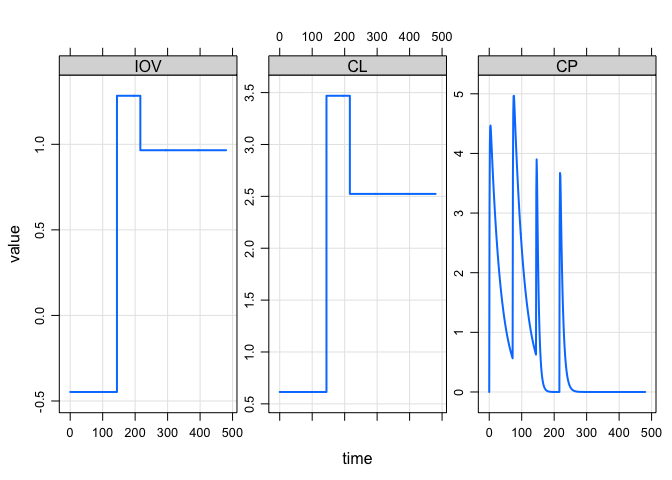

Interoccasion variability
================

``` r
library(mrgsolve)
library(dplyr)
```

## Model code

  - More than likely, you will need a occasion indicator (like `OCC`) in
    both your parameter list and the data set.
  - Create a variable (`IOV`) that holds the inter-occasion random
    effect.
  - For three occasions, you’ll need three ETAs; assign them as
    appropriate.
  - Recall that `mrgsolve` uses `nocb` advance.
  - For this set up, you’ll need 4x4 omega block (one for CL, and three
    for the occasions).
  - There is no need for `SAME` as in NONMEM; you always have control
    over the value for the OMEGAs. Just make them the **same** yourself.
  - You don’t have to use **labels** but it might be a good idea to
    avoid confusion.

<!-- end list -->

``` r
code <- '
$PARAM TVCL = 1, V = 20, KA = 1, OCC = 1

$PKMODEL cmt = "GUT CENT", depot = TRUE

$MAIN
capture IOV = ETA_OCC1;

if(OCC ==2) IOV = ETA_OCC2;

if(OCC ==3) IOV = ETA_OCC3;

capture CL  = TVCL*exp(ETACL + IOV);

$OMEGA @annotated
ETACL   : 0.1 : .
ETA_OCC1: 1.0 : .
ETA_OCC2: 1.0 : . 
ETA_OCC3: 1.0 : .

$POST
capture CP = CENT/V;

$SET req = ""
'
```

``` r
mod <- mcode_cache("iov", code)
```

## The data set

``` r
data <- realize_addl(ev(amt = 100, ii = 72, addl = 3, ID = 1)) %>% as.data.frame

data <- mutate(data, OCC = cumsum(evid)-1)
data
```

    .   ID time cmt amt evid ii addl OCC
    . 1  1    0   1 100    1  0    0   0
    . 2  1   72   1 100    1  0    0   1
    . 3  1  144   1 100    1  0    0   2
    . 4  1  216   1 100    1  0    0   3

## And simulate …

``` r
set.seed(101)
mrgsim(mod, data=data, end = 480) %>% plot
```

<!-- -->
