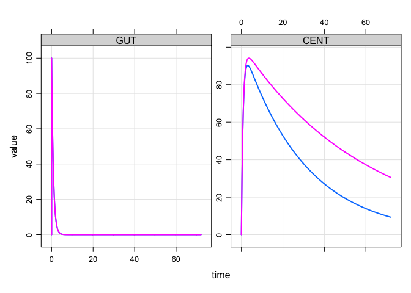

Mixture model example
================

In NONMEM, `$MIXTURE` will allow you to estimate mixture models, where individuals are classified in to two or more populations with a certain probability. It is straightforward to simulate from models like these in your `mrgsolve` model code.

Two Populations
===============

Let's imagine there were two populations in the mixture model, with the second having smaller clearance than the first. In this example, we will develop some code for a simple model and then extend it to implement the mixture model component.

A simple model might be:

``` r
library(mrgsolve)
library(dplyr)

code <- '
$PARAM TVCL = 1, V = 30, KA=1.2, POP = 1, THETA1 = 0.5

$PKMODEL cmt="GUT CENT", depot=TRUE

$MAIN
double CL = TVCL;

if(POP==2) CL = TVCL * THETA1;
'
```

In this model, we created a parameter for the population indicator (`POP`) and if `POP` is 2 then clearance is lower than it would be otherwise.

Compile this model and run

``` r
mod <- mcode_cache("A", code) %>% update(end=72, delta=0.1)

idata <- data_frame(POP=c(1,2))

e <- ev(amt=100)

mod %>% mrgsim(idata=idata,events=e) %>% plot
```



The profile in pink was for `POP==2` or the lower clearance profile and blue was for `POP==1`.

Modify the model to simulate a population mixture
-------------------------------------------------

In the get-started exmaple model, we hard-coded `POP` as a parameter and we had to supply the value of `POP` in the input data set (in this case, it was via `idata`).

For the mixture model, we want `POP` to be simulated and we want the simulated value to be 1 with a probability of, say, 0.8 and 2 with a probability of 0.2.

To make this happen, we need to simulate a binary variate for each individual. Random numbers are easy to simulate with `mrgsolve` when you use `$PLUGIN`.

``` r
code <- '
$PLUGIN Rcpp

$MAIN
if(NEWIND <=1) {
  int POP = 1 + R::rbinom(1,0.2);
}

$CAPTURE POP
'

mod <- mcode_cache("B", code)
```

Here, we invoked the `Rcpp` plugin that allows us to call `R::binom(1,0.8)`. `R::binom` is just like the regular `R` version, but it only draws one variate (`n=1`).

Let's test it out

``` r
set.seed(222)
out <- mrgsim(mod, nid=10000, end=-1)

head(out)
```

    . Model:  B

    .   ID time POP
    . 1  1    0   2
    . 2  2    0   1
    . 3  3    0   1
    . 4  4    0   1
    . 5  5    0   2
    . 6  6    0   2

Here, we've got 20% of the people in the population with `POP` of 2:

``` r
mean(out$POP==2)
```

    . [1] 0.1973

Now, let's modify the model again to incorporate our random `POP` calculation with the PK model. I have also included a home-brewed `ETA` using `R::rnorm` as another example and to make the summary a little more interesting.

``` r
code <- '
$PLUGIN Rcpp

$PARAM TVCL = 1, V = 30, KA=1.2, THETA1 = 0.5

$PKMODEL cmt="GUT CENT", depot=TRUE

$MAIN
if(NEWIND <=1) {
  int POP = 1 + R::rbinom(1,0.2);
  double myETA = R::rnorm(0,sqrt(0.09));
}

double CL = TVCL;

if(POP==2) CL = TVCL * THETA1;

double CLi = CL*exp(myETA);

$CAPTURE POP CL CLi
'

mod <- mcode_cache("C", code)
```

And simulate again

``` r
set.seed(444)
out <- mrgsim(mod,nid=10000, end=72, events=e,obsonly=TRUE)
```

``` r
head(out)
```

    . Model:  C

    .   ID time        GUT     CENT POP CL       CLi
    . 1  1    0  0.0000000  0.00000   1  1 0.7642753
    . 2  1    1 30.1194212 68.50511   1  1 0.7642753
    . 3  1    2  9.0717953 86.89259   1  1 0.7642753
    . 4  1    3  2.7323722 90.25855   1  1 0.7642753
    . 5  1    4  0.8229747 89.17134   1  1 0.7642753
    . 6  1    5  0.2478752 86.81173   1  1 0.7642753

``` r
mean(out$CL==0.5)
```

    . [1] 0.1977

``` r
out %>% 
  filter(time==0) %>%
  group_by(POP) %>% 
  summarise(N=n(), Median = median(CLi))
```

    . # A tibble: 2 x 3
    .     POP     N    Median
    .   <dbl> <int>     <dbl>
    . 1     1  8023 1.0026133
    . 2     2  1977 0.4985587

Three (or more) Populations
===========================

There are probably several ways to simulate three populations. Here is one way. We'll drop the PK model for now and focus on generating `POP`.

``` r
code <- '
$PARAM p1 = 0.33, p2 = 0.6

$PLUGIN Rcpp

$MAIN
if(NEWIND <=1) {
  double mixv = R::runif(0,1);
  int POP = 1;
  if(mixv > p1) POP = 2;
  if(mixv > (p1+p2)) POP = 3;
}

$CAPTURE POP mixv
'
```

Here's what we did

-   Code mixture probabilities in `$PARAM`
-   Draw a variate (`mixv`) from `uniform(0,1)`
-   Determine `POP` based on the probabilites and `mixv`
-   Remember: you must use `$PLUGIN` for this to work

Now, let's compile and test it out

``` r
mod <- mcode_cache("D", code)

set.seed(333)
out <- mrgsim(mod, nid=10000, end=-1)
```

``` r
head(out)
```

    . Model:  D

    .   ID time POP       mixv
    . 1  1    0   2 0.46700066
    . 2  2    0   1 0.08459815
    . 3  3    0   3 0.97348527
    . 4  4    0   2 0.57130558
    . 5  5    0   1 0.02011937
    . 6  6    0   2 0.72355739

And check that the population is properly configured

``` r
out %>% as.tbl %>% count(POP) %>% mutate(p = n/nrow(out))
```

    . # A tibble: 3 x 3
    .     POP     n      p
    .   <dbl> <int>  <dbl>
    . 1     1  3225 0.3225
    . 2     2  6053 0.6053
    . 3     3   722 0.0722

And we get back the 33% in population 1, 60% in population 2, and the remaining 7% in population 3.

As a final note: remember to call `set.seed()` prior to simulating anything random with `mrgsovle` in order for the results to be reproducible.
